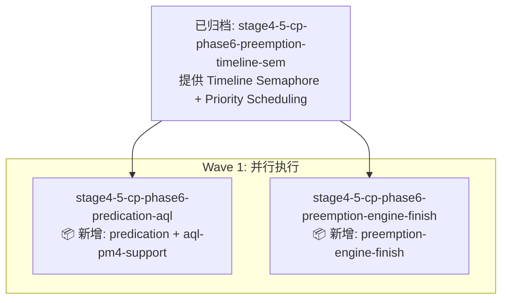

# 依赖分析报告 — Stage 4.5 Phase 6 两个 Change

> 生成时间: 2026-07-29
> 候选数: 2
> 分析模式: 静态三轴分析（AI 子代理降级）

## 📋 候选 Changes

| # | Name | Capabilities | 优先级 |
|---|------|-------------|--------|
| 1 | `stage4-5-cp-phase6-predication-aql` | `predication`, `aql-pm4-support` | P1 |
| 2 | `stage4-5-cp-phase6-preemption-engine-finish` | `preemption-engine-finish` | P1 |

## 🎯 三轴依赖分析

### 轴 1：文件冲突检测 ✅ 无冲突

| Change A | Change B | 交集 | 判定 |
|----------|----------|------|------|
| predication-aql | preemption-engine-finish | **无**（分别修改 gpu_queue.h 和 hardware_puller_emu.cpp） | ✅ 可并行 |

### 轴 2：ADR 依赖链检测

| 共享 ADR | 说明 | 影响 |
|---------|------|------|
| ADR-045 | Priority Scheduling | 两者均依赖（已 ✅ Accepted） |
| ADR-046 | Preemption & Context Switch | preemption 直接依赖；predication 间接依赖（preempt 保存 predicate 状态） |
| ADR-049 | Cross-Engine Sync / Timeline Semaphore | 两者均依赖（已 ✅ Accepted，由已归档 change 实施） |
| ADR-054 | MQD/HQD state | 两者均涉及（preemption 直接，predication 间接） |

**判定**：两者均依赖已归档的 `stage4-5-cp-phase6-preemption-timeline-sem` 提供的 Timeline Semaphore 基础设施，自身**无相互依赖**。

### 轴 3：接口依赖检测

| Change | 新增 Capability | 依赖其他 Change 的接口 |
|--------|----------------|----------------------|
| `predication-aql` | `predication` | 无（独立能力） |
| `predication-aql` | `aql-pm4-support` | 依赖 `timeline-semaphore`（已实现，completion_signal 桥接） |
| `preemption-engine-finish` | `preemption-engine-finish` | 依赖 `timeline-semaphore`（已实现，fence 语义）+ `priority-scheduling`（已实现） |

**判定**：两者均依赖**已归档**的 Timeline Semaphore，相互**无接口依赖**。

## 📊 Change 状态表

| Change | 状态 | 阻塞于 | 阻塞了谁 | 冲突 | 推荐 |
|--------|------|--------|---------|------|------|
| `stage4-5-cp-phase6-predication-aql` | ✅ ready | — | — | — | Wave 1 |
| `stage4-5-cp-phase6-preemption-engine-finish` | ✅ ready | — | — | — | Wave 1 |

## 🗺️ 依赖图（Mermaid）



**关键观察**：
- A 和 B **无相互依赖**（无文件交集、无 capability 交叉）
- 两者均依赖已归档的 Timeline Semaphore（ADR-049 ✅）
- 两者**可以并行执行**

## 📋 推荐执行顺序

```
Wave 1（并行 — 无相互依赖）:
  ├─ stage4-5-cp-phase6-preemption-engine-finish  (Preemption 引擎核心收尾)
  └─ stage4-5-cp-phase6-predication-aql           (Predication + AQL 支持)
```

**并行建议**：两个 change 文件交集为空，可在不同 worktree 中并行实施，最后合并到 main。

## ⚠️ 风险与缓解

| 风险 | 缓解 |
|------|------|
| ChannelState 字段冲突 | 两者新增字段不重叠（`pending_fences_` vs `predicate_snapshot_`），按 PR 顺序合并即可 |
| Puller FSM 状态机复杂度 | preemption 检查点在 batch 边界，predication 检查在 DECODE 阶段，层次清晰 |
| TSan 暴露并发问题 | 都复用 Timeline Semaphore 已验证的 release/acquire 语义 |
| ADR 升级次序 | 实施后立即升级 ADR-046/051/052 状态为 Accepted |

## 🔗 关联 ADR 状态

| ADR | 标题 | 当前状态 | 实施后状态 |
|-----|------|---------|-----------|
| ADR-045 | Priority Scheduling | ✅ Accepted | ✅ Accepted |
| ADR-046 | Preemption & Context Switch | 📋 PROPOSED | ✅ Accepted (实施后) |
| ADR-049 | Cross-Engine Sync | ✅ Accepted | ✅ Accepted |
| ADR-050 | Indirect Buffer | ✅ Accepted | ✅ Accepted |
| ADR-051 | Predication & Conditional Execution | 📋 PROPOSED | ✅ Accepted (实施后) |
| ADR-052 | AQL/PM4 Native Support | 📋 PROPOSED | ✅ Accepted (PM4 deferred, 实施后) |
| ADR-054 | MQD/HQD state | ✅ Accepted | ✅ Accepted |
| ADR-056 | Green Context / PDL | 📋 PROPOSED | (本 change 不涉及) |

---

## ⚠️ AI 语义分析未启用 (fallback)

本报告基于**静态三轴分析**（文件冲突、ADR 引用、接口依赖）。AI 子代理语义分析不可用。

**缺失能力**：
- 语义依赖分析（隐式依赖推断）
- 粒度评估（过大/过小判定）
- 重组建议（合并/拆分/重排）

**结论**：两个 change 粒度合理，可独立并行实施。

---

**生成脚本**: 静态三轴分析（`/workspace/project/UsrLinuxEmu/.rddf/state/.deps-candidates.json`）
**输出文件**: `/workspace/project/UsrLinuxEmu/.rddf/state/.deps-output.md`