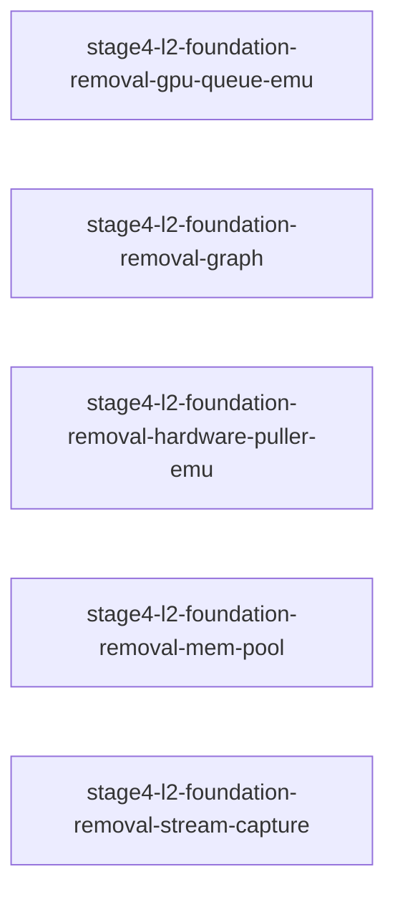

# 依赖分析报告

生成时间: 2026-08-04T07:46:48.641617+00:00
候选 changes: 5

## 依赖图 (Mermaid)

## 阶段预检

基于每 change 的 `roadmap-meta.yaml`：

| Change | Phase | Category | 状态 |
|--------|-------|----------|------|
| stage4-l2-foundation-removal-gpu-queue-emu | stage-4.7 | core-impl | ✅ 在阶段内 |
| stage4-l2-foundation-removal-graph | stage-4.7 | core-impl | ✅ 在阶段内 |
| stage4-l2-foundation-removal-hardware-puller-emu | stage-4.7 | core-impl | ✅ 在阶段内 |
| stage4-l2-foundation-removal-mem-pool | stage-4.7 | core-impl | ✅ 在阶段内 |
| stage4-l2-foundation-removal-stream-capture | stage-4.7 | core-impl | ✅ 在阶段内 |

## Change 状态表

| Change | 状态 | 推荐 | 备注 |
|--------|------|------|------|
| stage4-l2-foundation-removal-gpu-queue-emu | ✅ ready | 第 1 |  |
| stage4-l2-foundation-removal-graph | ✅ ready | 第 1 |  |
| stage4-l2-foundation-removal-hardware-puller-emu | ✅ ready | 第 1 |  |
| stage4-l2-foundation-removal-mem-pool | ✅ ready | 第 1 |  |
| stage4-l2-foundation-removal-stream-capture | ✅ ready | 第 1 |  |

## 推荐执行顺序

1. `stage4-l2-foundation-removal-gpu-queue-emu` ← 第一个候选

## 冲突警告

（如有文件冲突将列于此处）

## 🧠 AI 分析建议

⚠️ **AI 语义分析未启用 (fallback)** - 子代理不可用或调用失败, 详见 deps.md Step 3f
以下内容为基于静态三轴分析（文件冲突、ADR 引用、接口依赖）的结论。
AI 子代理语义分析功能（语义依赖、粒度评估、重组建议）待子代理可用时启用。
