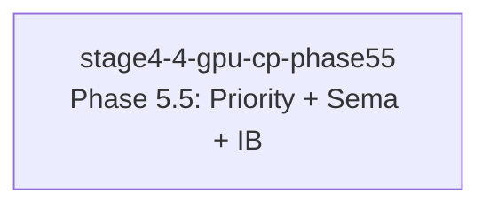

# 依赖分析报告

## 依赖图



**说明**: 当前仅 1 个 change，无依赖关系，可直接执行。

## Change 状态表

| Change | 状态 | 阻塞于 | 阻塞了谁 | 冲突 |
|--------|------|--------|---------|------|
| stage4-4-gpu-cp-phase55 | ✅ ready | — | — | — |

## 推荐执行顺序

```
1. stage4-4-gpu-cp-phase55 ← 唯一 change，可直接进入 ship 阶段
```

## 冲突警告摘要

```
🟢 无冲突 — 仅 1 个 change
```

## 内部依赖（三大模块执行顺序）

根据 design.md 定义的内部依赖，change 内部三模块建议顺序：

```
1. Semaphore/Barrier     ← 最底层原语，其他模块可能依赖
2. Priority Scheduling   ← 调度层，需要 semaphore 做优先级反转测试
3. Indirect Buffer       ← 扩展指令层，独立可测试
```

## ADR 引用

| ADR | 状态 | 用途 |
|-----|------|------|
| ADR-045 | 📋 PROPOSED | Priority Scheduling |
| ADR-047 | 📋 PROPOSED | Semaphore/Barrier |
| ADR-050 | 📋 PROPOSED | Indirect Buffer |
