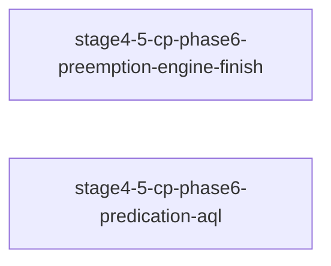

# 依赖分析报告

生成时间: 2026-07-30T07:35:56.743613+00:00
候选 changes: 2

## 依赖图 (Mermaid)

## 阶段预检

基于每 change 的 `roadmap-meta.yaml`：

| Change | Phase | Category | 状态 |
|--------|-------|----------|------|
| stage4-5-cp-phase6-preemption-engine-finish | (compat) | (compat) | ⚠️ 无 roadmap-meta |
| stage4-5-cp-phase6-predication-aql | (compat) | (compat) | ⚠️ 无 roadmap-meta |

## Change 状态表

| Change | 状态 | 推荐 | 备注 |
|--------|------|------|------|
| stage4-5-cp-phase6-preemption-engine-finish | ✅ ready | 第 1 |  |
| stage4-5-cp-phase6-predication-aql | ⚠️ blocked_by | stage4-5-cp-phase6-preemption-engine-finish |  |

## 推荐执行顺序

1. `stage4-5-cp-phase6-preemption-engine-finish` ← 第一个候选

## 冲突警告

（如有文件冲突将列于此处）

## 🧠 AI 分析建议

**子代理语义分析结果** (来源: `/workspace/project/UsrLinuxEmu/.rddf/state/.deps-ai-result.json`):

**AI 识别的额外依赖** (低置信度, 仅作参考):

- `stage4-5-cp-phase6-preemption-engine-finish` → `stage4-5-cp-phase6-predication-aql` (hard): predication-aql tasks 3.2/3.3 依赖 engine-finish 接线的 mqd_state_preempt()/mqd_state_resume() 调用链才能挂接 predicate save/restore，design.md 明确声明'必须在 engine-finish 之后执行'
- `stage4-5-cp-phase6-preemption-engine-finish` → `stage4-5-cp-phase6-predication-aql` (soft): 两 change 共享 ADR-049(Timeline Semaphore) 和 ADR-054(MQD) 作为基础设施，且同属 Stage 4.5 Phase 6 能力闭合

**重组建议** (仅建议不执行):

- `stage4-5-cp-phase6-predication-aql`: split — Predication(ADR-051) 和 AQL/PM4(ADR-052) 是逻辑独立的两个能力，可拆分为两个 change 以降低单 change 粒度并允许并行实施 AQL 部分 (parent_feature: stage4-5-phase6-gpu-cp)
- `stage4-5-cp-phase6-preemption-engine-finish`: reorder — engine-finish 必须优先执行，因为它是 predication-aql 的硬依赖前置块 (parent_feature: stage4-5-phase6-gpu-cp)