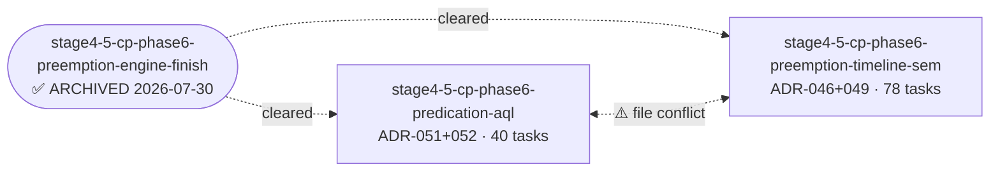

# 依赖分析报告

生成时间: 2026-07-31T00:11:00+00:00
候选 changes: 2

## 依赖图 (Mermaid)

## 阶段预检

基于每 change 的 `roadmap-meta.yaml`：

| Change | Phase | Category | 状态 |
|--------|-------|----------|------|
| stage4-5-cp-phase6-predication-aql | stage-4.5 | core-impl | ✅ proposed |
| stage4-5-cp-phase6-preemption-timeline-sem | stage-4.5 | core-impl | ✅ proposed |

## Change 状态表

| Change | 状态 | 推荐 | 备注 |
|--------|------|------|------|
| stage4-5-cp-phase6-preemption-timeline-sem | ✅ ready | 第 1 | blocker `preemption-engine-finish` 已 archived，依赖已清除 |
| stage4-5-cp-phase6-predication-aql | ⚠️ file-conflict | 第 2 或与 #1 协调 | blocker 已清除但与 #1 共享文件需协调 rebase |

## 推荐执行顺序

1. `stage4-5-cp-phase6-preemption-timeline-sem` ← 第一个执行（任务量 78，最大，先做以避免阻塞后续）
2. `stage4-5-cp-phase6-predication-aql` ← 在 #1 完成后或并行（共享文件需协调 rebase）

**理由**：
- 两个 change 的 blocker (`preemption-engine-finish`) 已在 2026-07-30 archived
- 两个 change 共享两个文件（`channel_state.{h,cpp}` + `hardware_puller_emu.{h,cpp}`），需要 worktree 协调
- preemption-timeline-sem 工作量更大（78 tasks vs 40 tasks），优先执行减少并行复杂度

## 冲突警告

### ⚠️ 文件冲突（必须协调 rebase）

| 文件 | 涉及 Change | 冲突类型 |
|------|------------|----------|
| `plugins/gpu_driver/sim/scheduler/channel_state.{h,cpp}` | predication-aql §3, preemption-timeline-sem §5.3 | 同字段扩展（`PredicateState` vs `ChannelSemaphoreState`） |
| `plugins/gpu_driver/sim/hardware/hardware_puller_emu.{h,cpp}` | predication-aql §1-2, preemption-timeline-sem §6 | FSM 扩展（predicate skip vs preempt checkpoint） |
| `plugins/gpu_driver/shared/gpu_queue.h` | predication-aql §1.2/4.1, preemption-timeline-sem §2.1 | GPFIFO entry 扩展（`GPU_OP_SET_PREDICATE` enum vs `timeline` field） |

**冲突解决建议**：
- preemption-timeline-sem 先实施 → predication-aql 在 rebase 时优先保留自己的 GPFIFO entry 字段扩展（`format`），preemption-timeline-sem 的 `timeline` 字段插入到结构体末尾
- channel_state.h 建议分层：`PredicateState` 和 `ChannelSemaphoreState` 都作为独立子 struct，避免直接字段冲突

## 🧠 AI 分析建议

**两个 change 均为 Stage 4.5 Phase 6 能力闭合（parent_feature: stage4-5-phase6-gpu-cp）**：

- **独立 ADR 链**：
  - predication-aql 闭合 ADR-051（Predication）+ ADR-052（AQL/PM4，PM4 deferred）
  - preemption-timeline-sem 闭合 ADR-046（Preemption）+ ADR-047（Semaphore）+ ADR-049（Timeline Semaphore，D1 修订为 waiter 回调）+ ADR-040 迁移注记
- **共享基础设施**：ADR-054（MQD state）— 两个 change 都依赖 `mqd_state_preempt/resume` API
- **能力关系**：preemption 是为了支持 HIGH priority batch 抢占 LOW batch；timeline sem 是用于跨引擎 fence 同步。两者在概念上独立，但实现上共享 Puller FSM 边界检查点
- **依赖关系**：无 hard dependency（彼此不互相阻塞），仅 file conflict
- **推荐执行**：preemption-timeline-sem 先做（任务量大，先完成避免后续依赖），predication-aql 后做（或在 preemption-timeline-sem 接近完成时并行启动，最后 rebase）

**重组建议**（仅建议不执行）：

- 维持现状：两个 change 已是合理粒度，preemption-timeline-sem 78 tasks 较大但内聚（preemption + timeline sem 是同一架构层的两个能力）
- 不建议拆分 preemption-timeline-sem：preemption + timeline sem 共享 ChannelSemaphoreState，强行拆分会增加集成复杂度
- 不建议合并：predication + AQL 是独立能力，已合并体现 ADR-051/052 的设计一致性

## 已归档基线（context）

`stage4-5-cp-phase6-preemption-engine-finish` 已在 2026-07-30 archived，其交付的 `mqd_state_preempt/resume` API 是两个 active change 的共享基线。两个 change 的 blocker 字段保留指向 archived change 是为了审计追溯，不影响执行调度。