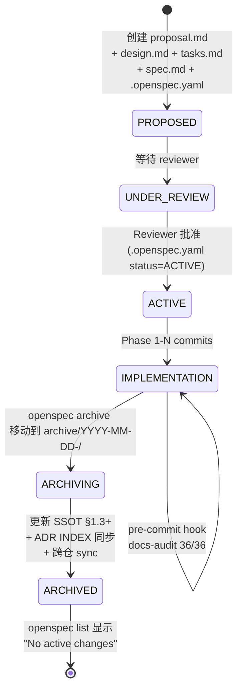
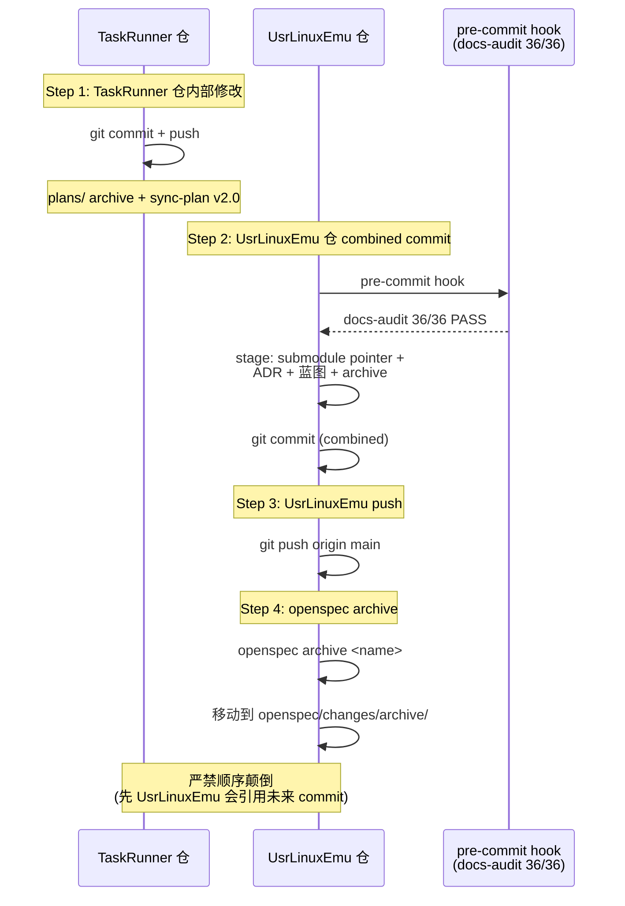

# UsrLinuxEmu 重构后架构与文档同步方案

> **SSOT** | 最后验证: 2026-06-17 | 对应代码 commit: `374d463`
>
> **作者**: UsrLinuxEmu Architecture Team
> **状态**: ✅ Approved（v0.1.7）
> **作用**: 在 2026-05 ~ 06 期间完成 Phase 1.5 / Phase 2 重大重构后，建立**重构后架构**与**docs 现状**之间的对账，并给出 32 项修复建议
>
> **历史审计报告**：[`docs/02_architecture/audit-reports/`](audit-reports/)（含 v0.1.6 首次深度审计，25 项偏差：🔴 1 / 🟠 4 / 🟡 14 / 🟢 6）

---

## 目录

- [§0 文档定位](#0-文档定位)
- [§1 重构后架构总览](#1-重构后架构总览)
  - [1.1 重构时间轴](#11-重构时间轴)
  - [1.2 架构一张图](#12-架构一张图)
  - [1.3 关键数据流（Phase 2 完整版）](#13-关键数据流phase-2-完整版)
  - [1.4 数据模型（VA Space / Queue / Ring Buffer）](#14-数据模型va-space--queue--ring-buffer)
  - [1.5 仓库物理布局](#15-仓库物理布局)
  - [1.6 IOCTL 体系（System A / B / C）](#16-ioctl-体系system-a--b--c)
  - [1.7 测试框架（声称 vs 实际）](#17-测试框架声称-vs-实际)
  - [1.8 当前架构的"权威文档"空白](#18-当前架构的权威文档空白)
  - [§1.10 3 区分架构原则](#110-3-区分架构原则)
- [§2 docs/ 审计发现](#2-docs-审计发现)
  - [2.1 整体健康度](#21-整体健康度)
  - [2.2 类别 1：断裂的 Markdown 链接](#22-类别-1断裂的-markdown-链接)
  - [2.3 类别 2：对已删除/迁移路径的引用](#23-类别-2对已删除迁移路径的引用)
  - [2.4 类别 3：引用废弃 API/代码（System B vs System C）](#24-类别-3引用废弃-apicode)
  - [2.5 类别 4：测试框架声明不一致](#25-类别-4测试框架声明不一致)
  - [2.6 类别 5：IOCTL 编号冲突](#26-类别-5ioctl-编号冲突)
  - [2.7 类别 6：内部不一致](#27-类别-6内部不一致)
- [§3 修复建议（32 项）](#3-修复建议32-项)
  - [3.1 🔴 P0 - 必须立即修复（10 项）](#31--p0---必须立即修复10-项)
  - [3.2 🟠 P1 - 高优先级（12 项）](#32--p1---高优先级12-项)
  - [3.3 🟡 P2 - 中优先级（7 项）](#33--p2---中优先级7-项)
  - [3.4 🟢 P3 - 低优先级（3 项）](#34--p3---低优先级3-项)
- [§4 关键执行原则](#4-关键执行原则)
- [§5 关键洞察](#5-关键洞察)
- [附录 A：完整 IOCTL 编号表](#附录-a完整-ioctl-编号表)
- [附录 B：归档目录清单](#附录-b归档目录清单)
- [变更记录](#变更记录)

---

## §0 文档定位

### §0.1 项目目标

> **开发一个易移植到 Linux 内核的 GPU 驱动**。

UsrLinuxEmu 通过 **3 区分架构**（[ADR-036](../00_adr/adr-036-three-way-separation.md)）实现这一目标：

- **① Linux 内核环境模拟** — 在用户态提供 Linux 内核 API（VFS / 调度 / IOMMU / mmu_notifier / DRM / PCIe / 中断）
- **② 可移植的驱动代码** — 用 Linux kernel 习语写，可直接拷贝到 `drivers/gpu/xxx/` 编译
- **③ 硬件模拟** — 模拟真实 GPU 硬件行为
- **HAL** — ②③ 之间的桥接适配器（per [ADR-036](../00_adr/adr-036-three-way-separation.md) §Decision）

**验证标准**：在 UsrLinuxEmu 开发的驱动代码**逻辑零修改**（仅 `#include` 路径需调整）即可在真实 Linux 内核中编译并运行。

### 本文与现有 docs 的关系

| 文档 | 定位 | 当前状态 | 日期 |
|------|------|----------|------|
| `AGENTS.md`（项目根） | 开发指南 + 架构要点 | 🟢 **相对准确**（已通过反向引用 SSOT 闭环，commit `3faa3a7`）| — |
| `docs/02_architecture/architecture.md` | 旗舰架构文档 | 🟢 v3.0（2026-06-16 对齐 Phase 1.5 → 2；引用 SSOT）| — |
| `docs/00_adr/adr-018~024` | 架构决策记录 | 🟡 准确但分散，关系图待更新 | — |
| `docs/README.md` | 文档索引 | 🟡 65% 完成度数字失真 | — |
| [ADR-036](../00_adr/adr-036-three-way-separation.md) | 3 区分架构原则 | ✅ Accepted | 2026-06-23 |
| [ROADMAP](../roadmap/README.md) | 架构演进路线图（4 阶段 + 蓝图，从 MVP 到终态）| 🔄 进行中 | 2026-06-23 |
| **本文**（post-refactor-architecture.md）| **重构后架构 SSOT + docs 同步方案** | ✅ Approved（v0.1.7）| — |

### 阅读对象

- **架构师 / 维护者**: 用 §1 作为架构唯一参考；用 §3 制定修复计划
- **新贡献者**: 先读 §1.2 一张图 + §1.5 仓库布局，再读 AGENTS.md
- **文档维护者**: §3 是修复任务清单；§4 是执行原则

### 关键事实

- `AGENTS.md` 已通过反向引用 `> **权威架构说明**：[post-refactor-architecture.md]` 与本文建立双向引用闭环（commit `3faa3a7`）
- 本文档已升为 ✅ Approved（v0.1.7），实现 SSOT 接管；架构部分反向引用闭环由 AGENTS.md commit `3faa3a7` 完成
- 修复完成后，AGENTS.md 的架构部分应**反向引用本文**而非重复内容

---

## §1 重构后架构总览

### 1.1 重构时间轴

| 阶段 | 时间 | 关键事件 | ADR / Commit |
|------|------|----------|--------------|
| **Phase 0** | 2025-12 ~ 2026-02 | 早期单仓库布局：`drivers/gpu/`(System B) + `simulator/gpu/` + `include/kernel/device/gpgpu_device.h` | ADR-001~009；README v0.1.0 |
| **Phase 1** | 2026-04 | **System C 引入**（`GPU_IOCTL_*` 替代 `GPGPU_*`）；新建 `plugins/gpu_driver/shared/gpu_ioctl.h` | ADR-015；commit `e9eff35` |
| **Phase 1.5** | 2026-05 上 | 设备信息扩展 + Build 修复 + libgpu_core 提取 + namespace wrap（`usr_linux_emu::`） | ADR-020；`d2399fb`, `fd3b1bc`, `e2066c9`, `ada84f3` |
| **Phase 1.5 → 2** | 2026-05 中 | **驱动/仿真代码分离**（`plugins/gpu_driver/{drv,hal,sim,shared}/`）；HAL 接口契约；Hardware Puller 状态机 | ADR-018, 021, 023；`d2399fb` |
| **Phase 2** | 2026-05-13 | ring buffer + GpuQueueEmu + 多队列 fetch + doorbell 修复 + **LAUNCH_CB 删除** + 队列 ioctl 接线 + ADR-024 + GlobalScheduler 回调链 + fence_id 异步跟踪 + **VA Space 抽象** | `7dc5cb2`, `5e0258e`, `b78edc9`, `daa5288`, `85b2e5b`, `5a25099`, `38de565` |
| **Repo 整理** | 2026-06-15 | openspec/ 归档 + AI 工具配置清理 + 删除未使用文件 + Testing 更新 | `71f6ff8`, `2f55f5e`, `d253574`, `1504893` |
| **H-2.5** | 2026-06-19 | **IGpuDriver 抽象层**（28 虚方法）+ `GpuDriverClient`/`CudaStub`/`MockGpuDriver` 三实现 + DI 注入 + CLI 死调用修复 + 命名空间迁移 (`taskrunner::` → `async_task::gpu::`) | [ADR-032](../../00_adr/adr-032-h2-5-igpu-driver-abstraction.md)；`c64301c`, `4834d5a`, `1684fa1`；openspec change `h2-5-architecture-foundation` |
| **H-3** | 2026-06-23 | **Phase 2 Lifecycle**（5 ioctl wrapper）+ D1-D5 决策（caller owns / explicit lifecycle / snake_case / return only / opt-in）+ R2 mapping contract 三重锁 + 12 doctest cases + 2 CLI subcommand | [ADR-033](../../00_adr/adr-033-h3-phase2-lifecycle.md)；TaskRunner `241f3ed`..`8625b82` (9 commits)；openspec change `h3-phase2-management` |
| **H-4** | 2026-06-23 | **Architecture Governance Cleanup**：归档 6 历史 plans + slim sync-plan v2.0 + 新增 ADR-032~035（含 35 ADR INDEX）+ 蓝图 §1.9 + cross-repo sync 流程化 | [ADR-035](../../00_adr/adr-035-governance-policy.md)；TaskRunner `200ca5e` + UsrLinuxEmu `2f954d3`；openspec change `h4-architecture-governance-cleanup` |

**关键观察**: Phase 1.5 → 2 期间，**2 周内 8 个功能 commit**（含 `d2399fb` libgpu_core 提取），但 docs/CHANGELOG 几乎没跟进——这是 docs 脱节的根本原因。H-4 治理 cleanup 部分修复此问题（每次 openspec change 归档后必须更新 SSOT §1.3+，见 [ADR-035 Rule 4](../../00_adr/adr-035-governance-policy.md)）。

### 1.2 架构一张图

```
┌─────────────────────────────────────────────────────────────────┐
│                      用户应用层 (User Space Apps)                │
│   • Test programs (tests/*)                                      │
│   • external/TaskRunner (submodule, symlink back)                │
│   • User-space drivers                                           │
└─────────────────────────────────────────────────────────────────┘
                                ↓ ioctl(fd, GPU_IOCTL_*, ...)
┌─────────────────────────────────────────────────────────────────┐
│              内核模拟框架层 (Kernel Framework)                   │
│   src/kernel/*.cpp  +  include/kernel/*.h    (kernel SHARED)   │
│   • VFS (Meyers singleton, Issue #11 修复)                      │
│   • ModuleLoader (静态 API) / PluginManager (CLI 用)            │
│   • ServiceRegistry / ConfigManager / Logger                    │
│   • WaitQueue / PollWatcher / FileOperations                   │
│   include/linux_compat/: u8/u32, ERR_PTR, _IOR, GFP_*           │
│   include/linux_compat/drm/: drm_ioctl.h, drm_driver.h, drm_gem │
│   include/linux_compat/: mmu_notifier.h, hmm.h (Stage 1.3 UVM)   │
└─────────────────────────────────────────────────────────────────┘
                                ↓ load via dlopen("plugins/*.so")
┌─────────────────────────────────────────────────────────────────┐
│                   设备驱动层 (Device Driver)                      │
│   plugins/gpu_driver/                                             │
│   • drv/         : GpgpuDevice (table ioctl via getIoctlTablePtr)│
│   • hal/         : struct gpu_hal_ops (11 fn-ptrs)             │
│                    + hal_user (mmap heap + buddy + fences)      │
│                    + hal_mock                                    │
│   • shared/      : gpu_ioctl.h, gpu_types.h, gpu_queue.h,       │
│                    gpu_events.h, gpu_regs.h   ← canonical 头     │
│   • plugin.cpp   : module mod 符号加载（dlopen + dlsym(handle, "mod")） │
│   drivers/        : sample_memory, sample_serial (示例)          │
└─────────────────────────────────────────────────────────────────┘
                                ↓ HAL ops + sim subsystems
┌─────────────────────────────────────────────────────────────────┐
│              硬件仿真层 (Hardware Simulation)                    │
│   plugins/gpu_driver/sim/                                         │
│   • sim/scheduler/  : GlobalScheduler (FIFO + engine routing)   │
│   • sim/scheduler/translator/                                   │
│                       : GpfifoToLaunchParamsTranslator           │
│   • sim/hardware/   : HardwarePullerEmu (FSM), DoorbellEmu      │
│   • sim/gpu_queue_emu.{h,cpp}   : Ring buffer 消费者 (Phase 2)  │
│   libgpu_core/        : 纯 C buddy allocator (gpu_buddy.h + buddy.c) │
└─────────────────────────────────────────────────────────────────┘
```

### 1.3 关键数据流（Phase 2 完整版）

```
User ioctl(fd, GPU_IOCTL_PUSHBUFFER_SUBMIT_BATCH, args)
   ↓
GpgpuDevice::ioctl() → table dispatch via getIoctlTablePtr()  (L82-100 实现，L112 调用)
   ↓
handlePushbufferSubmitBatch(args)  (gpgpu_device.cpp:247)
   ├─→ HAL.fence_create(&fence_id)  ← 异步跟踪 (gpgpu_device.cpp:272)
   ├─→ HardwarePullerEmu::submitBatch(gpfifo_addr, count)  (gpgpu_device.cpp:279)
   │     └─→ FSM: IDLE→FETCH (HAL.mem_read) →DECODE→        (hardware_puller_emu.cpp:107-188)
   │         SCHEDULE→DISPATCH→COMPLETE
   └─→ HAL.doorbell_ring(stream_id)                          (gpgpu_device.cpp:280)
   ↓
返回 args.fence_id 给用户  (gpgpu_device.cpp:281)
```

**重要异步性说明**（v0.1.2 勘误）：

`GlobalScheduler::enqueue(entry, selectEngine(entry))` **不在** handler 的同步执行路径上。`handlePushbufferSubmitBatch` 调用 `puller_->submitBatch(...)` 后**立即返回**；真正的 `scheduler_->enqueue(current_entry_, engine)` 在 `HardwarePullerEmu::runLoop()` 推进到 `State::DISPATCH` 状态时由独立工作线程异步触发（`hardware_puller_emu.cpp:156-163`）。`GpfifoToLaunchParamsTranslator::translate()` 同样由 scheduler 内部调用。

**Phase 2 安全校验**（v0.1.2 勘误；**v0.1.3 已实现**）：

SSOT 早期版本标注「`validate VA Space exists`（Phase 2 强制）」+「`validate Queue belongs to VA Space`」两个 handler 内校验环节。
v0.1.2 之前实现缺失（handler 仅校验 `count > 0`，`args->stream_id` 直接使用）。v0.1.3 由 OpenSpec change [fix-gpu-pushbuffer-va-space-validation] 落地：

```
Phase 2 校验（已实现 — change fix-gpu-pushbuffer-va-space-validation）：
├─→ validate VA Space exists（args->va_space_handle != 0 时）
├─→ validate Queue belongs to VA Space（同上）
```

`va_space_handle == 0` 视为"未指定" sentinel，跳过校验以保持向后兼容（design D1）。

**v0.1.3 收尾**（v0.1.4，change `h1-pushbuffer-validation-closeout`）：

- TaskRunner 同步：`GpuDriverClient` 加 `setCurrentVASpace()` 透传 `args.va_space_handle`（submodule commit `ff52e64`，branch `h1-pushbuffer-validation-closeout`）
- archive 目录纳入 git 跟踪：`openspec/changes/archive/2026-06-17-fix-gpu-pushbuffer-va-space-validation/` 6 文件（修复 `744ef46` archive tracking 遗漏 + `.gitignore` 收紧 `/archive/` 仅根级）

### 1.4 数据模型（VA Space / Queue / Ring Buffer）

```
VASpace  (u64 handle, 内部 struct GpgpuDevice::VASpace，gpgpu_device.h:72-78)
   ├─ page_size (0=4KB, 1=64KB)
   ├─ flags
   ├─ created_at  (内部字段，v0.1.2 勘误补录)
   └─ attached_queues: [queue_handle]
         ↓
Queue  (u64 handle 是 GpgpuDevice::queues_ map 的 key；内部 GpuQueueEmu shared_ptr)
   ├─ GpuQueueEmu::queue_id_ (u32，内部 ID；≠ 外层 handle，v0.1.2 勘误)
   ├─ queue_type (COMPUTE/COPY/GRAPHICS)
   ├─ priority
   ├─ ring_size
   ├─ ring_buffer: gpu_ring_header (shm-backed)
   │     ├─ write_idx / read_idx (volatile)
   │     ├─ capacity (max 1024)
   │     ├─ flags / fence_value / reserved[32]  (v0.1.2 勘误补录)
   │     └─ entries[] (gpu_gpfifo_entry)
   ├─ doorbell_cb_ (callback；非 doorbell offset 本身)
   └─ doorbell offset 计算位置：GpgpuDevice::handleCreateQueue (gpgpu_device.cpp:410)
         公式：DOORBELL_ALLOC_BASE + handle * DOORBELL_ALLOC_STRIDE
```

**关键提醒**（v0.1.2 勘误）：Queue 的 **u64 handle 实际是 `GpgpuDevice::queues_` 这张 `unordered_map<uint64_t, std::shared_ptr<GpuQueueEmu>>` 的 key**（`gpgpu_device.h:123`），不是 `GpuQueueEmu` 内部字段。`GpuQueueEmu::queue_id_`（u32）是内部 ID，与外层 handle 不同。Doorbell offset 也不在 `GpuQueueEmu` 内，而在创建时由 `GpgpuDevice::handleCreateQueue` 计算并写入 `args->doorbell_pgoff`。

### 1.5 仓库物理布局

```
UsrLinuxEmu/
├── AGENTS.md                      ← 唯一非正式权威架构说明
├── README.md                      ← ✅ 已同步（v0.5+, 2026-06-16，Phase 2 + System C + Catch2 + TaskRunner）
├── CMakeLists.txt                 (project: user_kernel_emu)
├── build.sh, run_cli.sh
├── src/                           (kernel SHARED lib, 12 cpp)
├── include/
│   ├── kernel/                    (VFS, Device, FileOps, Module, WaitQueue, ...)
│   ├── linux_compat/              (compat.h, types, macros, memory, ioctl, drm/)
│   └── usr_linux_emu/             ⚠️ 空目录（命名空间预留，见 §4.6）
├── drivers/                       (sample_memory, sample_serial)
├── plugins/
│   ├── gpu_driver/{drv,hal,sim,shared}
│   ├── plugin_gpu_driver.so
│   └── plugins.json
├── libgpu_core/                   (纯 C buddy allocator, ADR-020)
├── tests/                         (Catch2 + standalone + sim)
├── tools/cli/                     ✅ 存在（main.cpp + CMakeLists.txt，构建产物 cli 在 build/bin/）
├── ~~simulator/~~                 ❌ 已 git-silent 删除（commit `4f42005`，2026-06-16；迁移到 plugins/gpu_driver/sim/ 在 Phase 1.5 完成，2026-05）
├── external/TaskRunner/           (submodule)
├── archive/                       ← 旧代码归档
│   ├── system_b_drivers/gpu/      (旧 GPGPU_*)
│   ├── system_b_examples/         (旧 sample_gpu)
│   ├── orphaned_simulator/gpu/
│   ├── old_gpu_device/
│   └── historical-plans-2026-06-15/
├── docs/                          ← 🔴 审计目标
└── zpoline/                       (不在 CMake)
```

**关键差异**（与 2026-03-23 旧 docs 描述相比）:

| 旧 docs 描述 | 实际位置 |
|--------------|----------|
| `drivers/gpu/buddy_allocator.{h,cpp}` | `archive/system_b_drivers/gpu/` |
| `drivers/gpu/ring_buffer.{h,cpp}` | `archive/system_b_drivers/gpu/` |
| `drivers/gpu/gpu_driver.{h,cpp}` | `archive/system_b_drivers/gpu/` |
| `drivers/gpu/ioctl_gpgpu.h` | `archive/system_b_drivers/gpu/` |
| `simulator/gpu/basic_gpu_simulator.{h,cpp}` | `archive/orphaned_simulator/gpu/` |
| `include/kernel/device/gpgpu_device.h` | `plugins/gpu_driver/drv/gpgpu_device.h` |
| `examples/*.cpp` | ❌ 不存在 |
| `benchmarks/*.cpp` | ❌ 不存在 |
| `plans/*.md`（根） | ❌ 不存在 |

### 1.6 IOCTL 体系（System A / B / C）

| 系统 | 状态 | 编号 | 头文件 | 位置 |
|------|------|------|--------|------|
| System A (`CUDA_*`) | ❌ 已删除 | - | - | - |
| System B (`GPGPU_*`) | ⚠️ 已归档 | 0x01-0x06 | `ioctl_gpgpu.h` | `archive/system_b_drivers/gpu/` |
| **System C (`GPU_IOCTL_*`)** | ✅ **当前** | **0x01-0x43** | `gpu_ioctl.h` | `plugins/gpu_driver/shared/` |

完整 System C 编号表见[附录 A](#附录-a完整-ioctl-编号表)。

### 1.7 测试框架（声称 vs 实际）

| 来源 | 声明 | 实际 |
|------|------|------|
| **代码**（`tests/catch_amalgamated.{hpp,cpp}`）| - | **Catch2**（vendored 单文件）|
| `README.md` | Google Test | Catch2 |
| `AGENTS.md` | **Catch2（明确反对 GTest）** | Catch2 |
| `.github/copilot-instructions.md` | Google Test | Catch2 |
| `docs/01-quickstart/installation.md` | `apt install libgtest-dev` | Catch2（不安装）|
| `docs/04-building/build_system.md` | `find_package(GTest REQUIRED)` | Catch2 |
| `docs/04-building/testing_guide.md` | 全文 `TEST()` / `EXPECT_*` | Catch2 `TEST_CASE` / `REQUIRE` |
| `docs/04-building/ci-cd.md` | `apt install libgtest-dev` | Catch2 |
| `docs/00_adr/adr-010-gtest-migration.md` | **✅ 已接受 Catch2（最终决策）** | **Catch2**（ADR-010 自身已对齐实际）|
| `CONTRIBUTING.md` | Catch2 | Catch2 |
| `docs/03-development/adding-devices.md` | Catch2 | Catch2 |
| `docs/06-reference/glossary.md` | Catch2 | Catch2 |

**结论**: ADR-010 已正式接受 Catch2（v0.1.7 同步）；实际项目用 Catch2。

### 1.8 当前架构的"权威文档"空白

- `AGENTS.md` 是唯一接近准确的架构说明，但**定位是"开发指南"**
- `docs/02_architecture/architecture.md` 严重过期（2026-03-23）
- `docs/05-advanced/gpu_driver_architecture.md` 子目录描述（mmu/, drm/, ttm/）全部**虚构**
- 曾经缺少一份"重构后的架构总览"文档 —— 已于 v0.1.5 创建本文闭环此 gap（v0.1.6 审计确认闭环证据见 §1.8.1）

#### §1.8.1 闭环证据（v0.1.6 审计确认）

v0.1.6 SSOT 深度审计（change `ssot-deep-audit`，commit `211b48c`）确认本 gap 已闭环：

- `post-refactor-architecture.md` 存在（47,232 字节，691 行）
- 28 个 `docs/` + AGENTS.md + README.md 范围内文件交叉引用本 SSOT
- 42 个项目全局 `.md` 文件引用本 SSOT
- 详细审计报告：[`docs/02_architecture/audit-reports/v0.1.6-audit.md`](audit-reports/v0.1.6-audit.md)（25 项偏差：🔴 1 / 🟠 4 / 🟡 14 / 🟢 6）
- 4 区域覆盖：§1.2 硬件仿真层 / §1.7 测试框架 / §1.8 权威空白 / 附录 A struct 字段

### 1.9 H-2.5 + H-3 跨仓架构（H-4 治理 cleanup 同步落地）

本节为 H-2.5（IGpuDriver 抽象层）+ H-3（Phase 2 lifecycle）实施后的架构 SSOT，对应 ADR-032 / ADR-033 / ADR-034 / ADR-035。

#### 1.9.1 IGpuDriver 抽象层（H-2.5）

```
                  ┌─────────────────────────────────────────────┐
                  │     IGpuDriver  (28 pure virtual methods)     │
                  │                                               │
                  │  核心 (3)            open/close/is_open         │
                  │  FD (1)              fd()                       │
                  │  设备信息 (8)        get_device_info, ...        │
                  │  Buffer Object (4)   alloc_bo/free_bo/map_bo    │
                  │  提交 (3)            submit_batch/memcpy/launch │
                  │  Fence (2)           wait_fence (2 重载)        │
                  │  VA Space 透传 (2)    set/get_current_va_space  │
                  │  Phase 2 (5)         create/destroy_va_space    │
                  │                      register_gpu               │
                  │                      create/destroy_queue       │
                  └────────────────────┬────────────────────────────┘
                                       │ DI 注入 (CudaScheduler 构造)
            ┌──────────────────────────┼──────────────────────────┐
            ▼                          ▼                          ▼
   ┌────────────────────┐    ┌────────────────────┐    ┌────────────────────┐
   │ GpuDriverClient    │    │ CudaStub           │    │ MockGpuDriver      │
   │ (真实 ioctl)        │    │ (in-memory mock)    │    │ (headless 测试夹具) │
   │ /dev/gpgpu0         │    │ monotonic handle    │    │ history()           │
   │ 5 Phase 2 ioctl    │    │ atomic + map 跟踪    │    │ inject_error()       │
   └────────────────────┘    └────────────────────┘    └────────────────────┘
```

**关键决策**（[ADR-032](../../00_adr/adr-032-h2-5-igpu-driver-abstraction.md) §Decision）：
- D6 接口签名对齐：28 方法签名同时被 3 实现覆盖
- D10 依赖注入：`CudaScheduler(driver = nullptr)` nullptr 时自动 new `CudaStub()`
- D11 CLI 死调用修复：`init_gpu_client()` 显式调用

#### 1.9.2 Phase 2 Lifecycle（H-3）

5 个 Phase 2 ioctl wrapper 在 IGpuDriver 接口的 Phase 2 占位上实现：

```
   ┌──────────────────────────────────────────────────────────────────┐
   │ TaskRunner 调用方（CLI / CudaScheduler / 测试）                    │
   │   创建:    create_va_space(flags) → handle                        │
   │            register_gpu(va, gpu_id, flags) → 0                    │
   │            create_queue(va, type, prio, ring) → handle            │
   │   销毁:    destroy_va_space(handle) / destroy_queue(handle)       │
   │   绑定:    set_current_va_space(handle)  // 显式 caller owns (D1) │
   └────────────────────────────┬─────────────────────────────────────┘
                                │ GpuDriverClient::create_va_space(flags)
                                ▼
   ┌──────────────────────────────────────────────────────────────────┐
   │ GpuDriverClient 实现层（include/gpu_driver_client.h:435-551）       │
   │   if (!is_open()) return 0;                                       │
   │   if (handle_arg == 0) return -1;  // H-1 sentinel 静默拒绝        │
   │   struct X args = {};  // 零初始化 (与 H-1 一致)                  │
   │   args.input_fields = ...;                                        │
   │   ioctl(fd_, GPU_IOCTL_*, &args);                                  │
   │   if (ret < 0) { cerr << "...failed (errno=" << errno << ")"; return 0; }│
   │   return args.output_handle;                                      │
   └────────────────────────────┬─────────────────────────────────────┘
                                │ ioctl 系统调用
                                ▼
   ┌──────────────────────────────────────────────────────────────────┐
   │ UsrLinuxEmu GPU Driver（plugins/gpu_driver/drv/gpgpu_device.cpp）    │
   │   handleCreateVaSpace(args) / handleCreateQueue(args)              │
   │   ├─→ validate va_space_handle 不为 0                            │
   │   ├─→ next_va_space_handle_++ (atomic)                            │
   │   ├─→ 创建内部 VASpace struct                                     │
   │   ├─→ args->va_space_handle = next_va_space_handle_                │
   │   └─→ 返回 0                                                      │
   └──────────────────────────────────────────────────────────────────┘
```

**关键决策**（[ADR-033](../../00_adr/adr-033-h3-phase2-lifecycle.md) §Decision）：
- D1 caller owns：`create_va_space()` 不自动 set `current_va_space_handle_`，caller 显式管理
- D2 explicit lifecycle：`create_queue()` / `destroy_queue()` 显式配对，无隐式 stream_id 绑定
- D5 opt-in default：构造时不自动 `create_va_space()`，H-1 sentinel (0) 跳过校验路径

**R2 mapping contract**（H-3 关键约束）：
```
生成侧 (UsrLinuxEmu gpgpu_device.cpp:412):  next_queue_handle_++ 单调 from 1
消费侧 (TaskRunner):                       保存完整 u64 queue_handle
submit 侧:                                 args.stream_id = (uint32_t)queue_handle (LOW32)
校验侧 (gpgpu_device.cpp:260-262):         static_cast<uint64_t>(stream_id) 必须在 attached_queues 中
```
**严禁 caller 自创 stream_id 替代 LOW32(handle)** —— 会触发静默 `-EINVAL`。

#### 1.9.3 Mermaid Diagrams

##### 图 1: IGpuDriver 三实现关系

```mermaid
graph TB
    A[CudaScheduler] -->|DI 注入| B[IGpuDriver interface]
    B --> C[GpuDriverClient<br/>真实 ioctl]
    B --> D[CudaStub<br/>in-memory mock]
    B --> E[MockGpuDriver<br/>headless test]

    C -->|ioctl| F[/dev/gpgpu0]
    F -->|UsrLinuxEmu GPU Driver| G[gpgpu_device.cpp]

    D --> H[monotonic handle<br/>atomic + map]
    E --> I[history() +<br/>inject_error()]

    style B fill:#e1f5ff
    style C fill:#ffe1e1
    style D fill:#fff4e1
    style E fill:#e1ffe1
```

##### 图 2: Phase 2 ioctl 流（H-3 create_va_space 示例）

```mermaid
sequenceDiagram
    participant CLI as CLI / Caller
    participant S as CudaScheduler
    participant G as GpuDriverClient
    participant K as Linux Kernel
    participant U as UsrLinuxEmu GPU Driver

    CLI->>S: create_va_space(flags=0)
    S->>G: driver_->create_va_space(flags)
    G->>G: !is_open() guard
    G->>G: struct args = {}; args.flags = 0
    G->>K: ioctl(fd, GPU_IOCTL_CREATE_VA_SPACE, &args)
    K->>U: handleCreateVaSpace(args)
    U->>U: next_va_space_handle_++
    U->>U: args->va_space_handle = handle
    U-->>K: return 0
    K-->>G: return 0
    G->>G: handle == 0? return 0
    G-->>S: return args.va_space_handle
    S-->>CLI: handle (u64)

    CLI->>S: set_current_va_space(handle)
    Note over S: D1: caller owns - 显式设置

    CLI->>S: submit_batch(stream_id=LOW32, ...)
    Note over S: R2 mapping: stream_id = (uint32_t)handle
    S->>G: submit_batch(stream_id, ...)
    G->>K: ioctl(fd, GPU_IOCTL_PUSHBUFFER_SUBMIT_BATCH, &args)
    K->>U: handlePushbufferSubmitBatch(args)
    U->>U: validate va_space_handle != 0 (H-1 fix)
    U->>U: validate queue belongs to va_space (H-1 fix)
    U-->>K: return fence_id
    K-->>G: return fence_id
    G-->>S: return fence_id
```

##### 图 3: openspec change lifecycle（H-4 治理流程）



##### 图 4: 跨仓 sync 流程（H-4 R5）



#### 1.9.4 H-7 Deferred Issues（ADR-034 注册表）

H-3 推迟 3 个 upstream issue 到 Phase 3 触发，详见 [ADR-034](../../00_adr/adr-034-h7-deferred-registry.md)：

| Issue | 触发位置 | 当前风险 | 推迟理由 |
|-------|---------|---------|---------|
| #1 stream_id u32 vs queue_handle u64 类型不匹配 | `gpgpu_device.cpp:262` | 长跑后 UINT32_MAX 溢出静默 -EINVAL | TaskRunner 遵守 R2 mapping 即可工作 |
| #2 ioctl path 绕过 GpuQueueEmu 抽象层 | `gpgpu_device.cpp:284-300` | 行为分歧难调试 | TaskRunner 仅走 ioctl path (R7) |
| #3 attached_queues 弱校验 | `gpgpu_device.cpp:260-262` | 静默 -EINVAL，race condition | 单测覆盖 happy path |

**Phase 3 触发条件**：详见 ADR-034 §"Phase 3 Trigger Conditions"（stream_id 接近 UINT32_MAX / mmap 路径实施 / 第三方 GPU service 接入）。

### 1.10 3 区分架构原则

> **参考**: [ADR-036](../00_adr/adr-036-three-way-separation.md) (✅ Accepted)
> **生效日期**: 2026-06-23
> **目的**: 显式化架构原则，为 driver 可移植性提供治理基础

#### 1.10.1 三层职责

| 层级 | 路径 | 职责 | 成熟度 |
|------|------|------|--------|
| ① Linux 内核环境模拟 | `src/kernel/`, `include/kernel/`, `include/linux_compat/` | 提供 Linux 内核 API（VFS/调度/IOMMU/mmu_notifier/DRM/PCIe/中断） | 🔄 渐进（Stage 1 完成度提升） |
| ② 可移植的驱动代码实现 | `plugins/gpu_driver/drv/` | GPGPU 驱动逻辑（KFD 风格），用真实 Linux 内核 API 写 | ✅ MVP（当前 GpgpuDevice 可工作） |
| ③ 硬件模拟 | `plugins/gpu_driver/sim/` | 模拟真实 GPU 硬件（pushbuffer/调度器/寄存器/fence/中断） | ✅ MVP（基础模拟完整） |

#### 1.10.2 HAL 的定位：桥接层（非第 4 层）

HAL（[`gpu_hal_ops`](../00_adr/adr-023-hal-interface.md)）位于 ② 和 ③ 之间，是**依赖注入点 / 桥接适配器**，不是独立的第四层：

- **UsrLinuxEmu 环境**：driver → HAL → `hal_mock.cpp` → sim/
- **真实 Linux kernel 环境**：driver → HAL → `hal_user.cpp` → 真实硬件
- driver 代码本身**零修改**即可切换环境

#### 1.10.3 与 ROADMAP 的关系

本原则是 [`docs/roadmap/`](../roadmap/README.md) 的架构基础。Stage 1（Linux 内核环境模拟）按 3 区分组织工作：每个子阶段（1.0 PCIe / 1.1 IOMMU+ATS / 1.2 DRM / 1.3 UVM/HMM / 1.4 集成）都明确标注影响哪些层。

##### sim 原语清单（③ 硬件模拟层的对外接口）

| 原语 | 头文件 | 阶段 | 用途 |
|------|--------|------|------|
| `sim_pfh_*` | `plugins/gpu_driver/sim/page_fault_handler.h` | Stage 1.3 | UVM/HMM page fault |
| `sim_pm_*`  | `plugins/gpu_driver/sim/page_migration.h`   | Stage 1.3 | UVM/HMM page migration |
| `sim_fence_id_*` | `plugins/gpu_driver/sim/fence_id.h`  | Phase 3.1+ (sim-stream-primitive-support) | sim 层 fence_id 分配器（范围 [(1<<32), INT64_MAX]） |
| `sim_stream_capture_*` | `plugins/gpu_driver/sim/stream_capture.h` | Phase 3.1 | cuStreamBeginCapture / EndCapture / Status |
| `sim_graph_*` | `plugins/gpu_driver/sim/graph.h`  | Phase 3.1 | CUDA Graph metadata simulation |
| `sim_mem_pool_*` | `plugins/gpu_driver/sim/mem_pool.h` | Phase 3.2 | cuMemPool* memory pool simulation |

> 详见 `docs/05-advanced/sim-primitives-reference.md`（API 参考手册）。
> 完整 ADR 引用：[ADR-015](../00_adr/adr-015-gpu-ioctl-unification.md)（IOCTL 编号表 0x50-0x67 已扩）。
> usecase：TaskRunner Phase 3.1/3.2（GpuDriverClient 通过 IOCTL 转发调用）。

##### Stage 1 子阶段进展（已完成）

- [x] PCIe Emulation Layer (`src/kernel/pcie/`, see [openspec/changes/stage-1-0-pcie-emu/](../../openspec/changes/stage-1-0-pcie-emu/))
  - Config space 4KB 读写 + 5 标准 capability 链（PM / MSI / PCIe / MSI-X / Vendor Specific）
  - MSI-X 向量表 + PBA + handler 注入
  - Linux-compat `pci_*` / `pci_msix_*` API 子集（`include/linux_compat/pci/`）
  - 3 个独立 Catch2 测试（`test_pcie_emu_standalone` / `test_config_space_standalone` / `test_msi_x_inject_standalone`）

- [x] IOMMU + ATS Layer (`src/kernel/iommu/`, see [openspec/changes/stage-1-1-iommu-ats/](../../openspec/changes/stage-1-1-iommu-ats/))
  - `iommu_domain` / `iommu_group` / `ioasid` 数据结构对齐 Linux 6.6/6.12 LTS（API 签名兼容，ABI 不承诺一致按 ADR-027）
  - 单级 4KB DMA remapping 页表（`iommu_map` / `iommu_unmap` / `iommu_iova_to_phys`，错误码语义与 Linux 一致 → [iommu-error-semantics.md](../05-advanced/iommu-error-semantics.md)）
  - ATS 协议最小子集：Translation Request/Completion + Invalidation Request/Completion（PCIe Base 6.0 §6.18，4 个核心消息）
  - IOTLB invalidate + `mmu_notifier` 集成点（**桩** + TODO(stage-1.3) 标记，由 stage-1.3 UVM/HMM 填充 body）
  - PCIe device → iommu_group 1:1 映射（register API，避免强求 stage-1.0 接口变更）
  - Linux-compat `linux/iommu.h` / `pci/ats.h` 子集（`include/linux_compat/iommu/`, `include/linux_compat/pci/ats.h`）
  - 默认 iommu_ops vtable（`iommu_default_ops_get()`）— 给 driver code 提供 Linux 风格调用路径
  - **HAL guardrail**：本次实现**不**预先添加 `hal_iommu_*` ops（按 ADR-027 spec-driven + ADR-035 治理；阶段 1.4 KFD 集成按需走 ADR 流程）
  - 错误码对照表：[docs/05-advanced/iommu-error-semantics.md](../05-advanced/iommu-error-semantics.md)

- [x] DRM Subset Layer (`src/kernel/drm/`, see [openspec/changes/archive/2026-07-02-stage-1-2-drm-subset/](../../openspec/changes/archive/2026-07-02-stage-1-2-drm-subset/))
  - `drm_gem_object` / `drm_file` / `drm_prime` / `drm_device` 数据结构对齐 Linux 6.12 LTS（API 签名兼容，ABI 不承诺一致按 ADR-027）
  - 19 IOCTL handler 通过 `drm_ioctl_desc[]` 表派发（7 既有 + 4 VA Space + 4 Queue + 4 KFD-compat 0x44-0x47）
  - 三个 DRM/KFD 设备节点：`/dev/dri/renderD128` + `/dev/dri/card0` + `/dev/kfd`（mode=0666 per ADR-037）
  - KFD 单文件 PoC `kfd_queue.c` 从 Linux 6.12 LTS 拷贝编译通过（errors=0, warnings=2，零逻辑修改）
  - KFD `gpu_kfd` C 库连入主构建（`plugins/gpu_driver/drv/kfd/CMakeLists.txt` + `add_subdirectory(kfd)`）
  - 真实 KFD 驱动多文件集成（5 个 ioctl 完整 + `kfd_process.c`）留到 Stage 1.4
  - **HAL guardrail**：本次实现**不**预先添加 `hal_drm_*` ops（0 ops 已添加，per ADR-027 spec-driven + ADR-035 治理）
  - 错误码对照表：[docs/05-advanced/drm-error-semantics.md](../05-advanced/drm-error-semantics.md)
  - 兼容矩阵（Linux 6.6 ↔ 6.12 LTS）：[docs/05-advanced/drm-compat-matrix.md](../05-advanced/drm-compat-matrix.md)
  - 1.2/1.3 边界契约 G1-G4：测试骨架 `tests/test_uvm_drm_lifecycle_standalone`（1.3 完整化）

- [x] UVM/HMM Layer (`src/kernel/uvm/`, see [openspec/changes/stage-1-3-uvm-hmm/](../../openspec/changes/stage-1-3-uvm-hmm/))
  - `mmu_notifier` / `hmm_range` / `migrate` / `fault_inject` / `zone_device` / `page_state_machine` 数据结构对齐 Linux 6.12 LTS
  - `mmu_interval_notifier` 替代已移除的 `hmm_mirror`（Decision 2）
  - Sequence number 协议：`mmu_interval_read_begin/retry/set_seq` + `hmm_range_fault`
  - PAGE_STATE_CPU / PAGE_STATE_GPU / PAGE_STATE_MIGRATING 三态机
  - ③ 硬件模拟层：`sim/page_fault_handler.cpp` + `sim/page_migration.cpp`
  - ② 可移植驱动层 `svm_ioctl.cpp` 延后至 Stage 1.4（按路线图 §1.3 ②）
  - **HAL guardrail**：0 ops 添加（`hal-uvm-ops-audit.md` 审计记录）
  - Linux-compat `linux_compat/mmu_notifier.h` / `linux_compat/hmm.h`
  - 错误码对照表：[docs/05-advanced/uvm-error-semantics.md](../05-advanced/uvm-error-semantics.md)
  - 兼容矩阵（Linux 6.6 ↔ 6.12 LTS）：[docs/05-advanced/hmm-compat-matrix.md](../05-advanced/hmm-compat-matrix.md)
  - 9 个 Catch2 standalone 测试（mmu_notifier / hmm_range / migrate / fault_inject / zone_device / page_state_machine / page_fault_handler / page_migration / svm_ioctl）
  - 完整化 `test_uvm_drm_lifecycle_standalone`（1.2 骨架 → 1.3 G1-G4 全验证）

#### 1.10.4 跨引用

- [ADR-036](../00_adr/adr-036-three-way-separation.md) — 3 区分架构原则
- [ADR-018](../00_adr/adr-018-driver-sim-separation.md) — 驱动/仿真分离（3 区分的前置）
- [ADR-023](../00_adr/adr-023-hal-interface.md) — HAL 接口契约（②③ 桥接层定义）
- [ADR-035](../00_adr/adr-035-governance-policy.md) — 治理规则（ADR 编号/状态/INDEX 同步）

##### Stage 1.4 Tier-1 交付边界（2026-07-04）

Stage 1.4 完成 5 个 KFD ioctl handler 穿透到 sim 原语的运行时行为（KFD API 契约 → sim 原语）。
**不追求多文件 KFD 集成**（卡 amdgpu headers，超出 Stage 1 范围，见 [Stage 1.4 PoC commit `5341c3f`](https://github.com/chisuhua/UsrLinuxEmu/commit/5341c3f) 实证）。

完整架构边界（Tier-1 已交付 / Tier-2 显式延后）见：
- **[kfd-portability-boundary.md](../05-advanced/kfd-portability-boundary.md)** — Tier-1/Tier-2 详细分界 SSOT
- **[kfd-portability-report.md](../05-advanced/kfd-portability-report.md)** — Stage 1.4 交付报告（commit `f41ace5`）

##### Stage 2 多设备插件化（2026-07-05, commit `fb75ed2` merge to main）

✅ **Stage 2 已达成**：3 区分架构横向扩展到 GPU 之外的设备类型（per ADR-036 + ADR-038）。

| 子任务 | 交付 | 状态 |
|--------|------|------|
| 2.0.1 handleMapQueueRing hotfix | Phase 2.5 segfault 修复 | ✅ commit `6d090e6` |
| 2.0 design + spike | Stage 2 设计 + GO/NO-GO spike | ✅ commits `5817910`+`a6f7212`+`9d90cfe` |
| 2.1.1 vfio 真实 IOTLB invalidation | Tier-2 deferred §3.2 吸收 | ✅ commit `6631b5d` |
| 2.1.2 mm_shim 真实进程模型 | Tier-2 deferred §3.3 吸收 | ✅ commit `3fe56d3` |
| 2.2.1 socket + sk_buff compat layer | ① net compat | ✅ commits `b1e8a54`+`7237bf5` |
| 2.2.2 net_driver plugin | ② ③ net device | ✅ commit `a5dd2a0` |
| 2.2.4 net_driver test (6 cases/34 assertions) | runtime test | ✅ commit `48a9d9f` |
| 2.2.5 3-way regression proof | ADR-038 D1 验证 | ✅ commit `aca18ec` |
| 2.3.1 bio_compat layer | ① block compat | ✅ commit `f009f8e` |
| 2.3.2 storage_driver plugin (+ sim) | ② ③ storage device | ✅ commit `8f66dd3` |
| 2.3.4 storage_driver test (5 cases/24 assertions) | runtime test | ✅ commit `65a3234` |
| 2.x release gate + CI hook | docs/audit 增强 | ✅ commits `70b2c95`+`380f4f7` |
| ADR-038 network stack 3-way boundary | architectural decision | ✅ commit `0b910c9` |

**测试演进**：
- Stage 1.4 Tier-2 baseline: 73/73
- Stage 2 完成: **76/76**（+3 net/storage/socket 测试）

**OpenSpec change**: `stage-2-multi-device` (archived `2026-07-05-stage-2-multi-device`，11 specs promoted)

**Tier-2 deferred absorption (Stage 1.4 → Stage 2)**:
- ✅ §3.2 IOMMU 真实 invalidation → vfio opt-in (Stage 2.1.1)
- ✅ §3.3 mmu_notifier 真实进程模型 → mm_shim PID + VMA (Stage 2.1.2)
- ⏸ §3.4 多文件 KFD 集成 → Stage 3+ 独立子项目（独立延后）
- ⏸ §3.5 完整 kfd_queue.c → 随多文件集成延后
- ⏸ ATS PRI/PRG response routing → Stage 2+ 条件性（仍未触碰）

详见 [stage-2-multi-device.md](../roadmap/stage-2-multi-device.md) + [ADR-038](../00_adr/adr-038-network-stack-three-way-separation.md)。

##### Stage 1.4 Tier-2 交付（2026-07-05, commit `6a7f4ab` merge to main）

✅ **Tier-2 §3.1/§3.2/§3.3 全部穿透完成**（10 commits, 73/73 ctest PASS, 0 regression）。

| 类别 | Tier-1 状态 | Tier-2 状态（穿透后） |
|------|------------|---------------------|
| 9 STUB_HANDLER（register_mmu_cb / firmware_cb / create_va_space / destroy_va_space / register_gpu / create_queue / destroy_queue / map_queue_ring / query_queue）| STUB (return 0) | **Penetrated** (commits `c33d824`+`8b6a33d`+`4261bb4`) |
| mmu_notifier callback body | TODO stage-1.3 | **Implemented** (commit `58777e5`) |
| IOTLB flush | fprintf stub | **Real page-table walk (user-space)** (commit `62d2353`) |
| 2 pre-existing fix (C ABI headers, dup sym) | build break | **Fixed** (commits `2322429`+`c8f986c`) |

**诚实保留（未触碰，按 boundary §5.2 显式延后）**：
- 多文件 KFD 集成（kfd_module.c / kfd_device.c / kfd_process.c / kfd_doorbell.c）→ Stage 3+ 独立子项目
- 完整 kfd_queue.c queue 生命周期 → 随多文件集成延后
- ATS PRI/PRG response routing → Stage 2+ 条件性
- IOMMU 真实硬件 invalidation（需 host kernel 介入）→ Stage 2 (vfio)

**详细报告**：[tier2-runtime-penetration-report.md](../05-advanced/tier2-runtime-penetration-report.md)  
**对应 OpenSpec**：[`openspec/changes/archive/2026-07-04-stage-1-4-tier2-kfd-integration/`](../../openspec/changes/archive/2026-07-04-stage-1-4-tier2-kfd-integration/) (archived)  
**boundary v1.1 状态更新**：[kfd-portability-boundary.md §3 状态映射](../05-advanced/kfd-portability-boundary.md#3-tier-2poC-实际超界必须显式记录--延后) 已标记 §3.1/§3.2/§3.3 为 Penetrated/Real Implementation/Implemented。

---

## §2 docs/ 审计发现

**审计时间**: 2026-06-15
**审计范围**: 50 个 .md 文件
**审计方法**: 三个并行 explore agent（路径验证 + 代码/API 交叉验证 + 文档互引一致性）
**总问题数**: **150+ 处**（CRITICAL 50+ / HIGH 60+ / MEDIUM 30+ / LOW 10+）

### 2.1 整体健康度

| 目录 | 状态 | 主要问题 |
|------|------|----------|
| `docs/00_adr/` (24 个 ADR) | 🟢 **治理完成**（v0.1.5）| ADR-022 缺失已修复（升 ✅ v1）；ADR-025/026/028/029/030 已转 ⏸️ 显式 Deferred；ADR-031 升 ✅ v1；ADR-010 "GTest 迁移"未实施（改 Catch2 选型说明留待后续） |
| `docs/01-quickstart/` | 🔴 **严重过期** | first-example.md 整章用废弃 `GPGPU_*` API；building.md 引用不存在的 `build/bin/cli_tool` |
| `docs/02_architecture/` | 🔴 **严重过期** | 全部基于 03-23 旧结构，含 `drivers/gpu/`、`simulator/gpu/`、旧 ioctl |
| `docs/03-development/` | 🔴 **严重过期** | guide.md/adding-devices.md 中 Device 类签名、`REGISTER_DEVICE_PLUGIN` 宏全错；架构对齐报告本身指出 6 处错误未修复 |
| `docs/04-building/` | 🔴 **严重过期** | testing_guide.md 全文 GTest 语法（实际 Catch2）；build_system.md 引用不存在的 `add_subdirectory(test)` |
| `docs/05-advanced/` | 🔴 **严重过期** | plugin-development.md 用 `PluginManager` 模式（实际用 `ModuleLoader`）；gpu_driver_architecture.md 描述不存在的子目录（mmu/, drm/, ttm/）|
| `docs/06-reference/` | 🔴 **严重过期** | api-reference.md/ioctl-commands.md 全文 GPGPU_*（System B），与 System C 不匹配 |
| `docs/07-integration/` | 🟡 **部分过期** | taskrunner-index.md 引用不存在的 `../../plans/sync-plan.md`；gpu-debug-faq.md/gpu-integration-guide.md 停留在 04-29 |
| `docs/pending/` | 🟡 **规划中** | 三份实施计划（gpu_driver_portability / linux_compat / umq-implementation）；引用 13 个不存在的 `test_compat_*.cpp` |
| `docs/superpowers/plans/` | 🟡 **过程记录** | 全文 GTest 语法（实际 Catch2） |
| `docs/archive/` | 🟢 **已归档** | 无需更新 |
| 顶层 `CHANGELOG.md` / `README.md` / `PRD.md` | 🔴 **严重过期** | CHANGELOG 引用不存在的 `02-core/`、`06-reference/adr.md`（已修复）|

### 2.2 类别 1：断裂的 Markdown 链接

**34+ 处**，主要子类型：

#### 1.1 kebab-case vs snake_case 拼错（**34 处，11 个文件，CRITICAL**）

| 文件 | 错误引用 | 正确引用 |
|------|----------|----------|
| `docs/README.md` | `04-building/build-system.md` | `04-building/build_system.md` |
| `docs/README.md` | `04-building/testing-guide.md` | `04-building/testing_guide.md` |
| `docs/README.md` | `05-advanced/gpu-driver-architecture.md` | `05-advanced/gpu_driver_architecture.md` |
| `docs/01-quickstart/building.md` | `../04-building/testing-guide.md` | `../04-building/testing_guide.md` |
| `docs/04-building/index.md` | `build-system.md` | `build_system.md` |
| `docs/04-building/index.md` | `testing-guide.md` | `testing_guide.md` |
| `docs/05-advanced/index.md` | `gpu-driver-architecture.md` | `gpu_driver_architecture.md` |
| `docs/06-reference/index.md` | `gpu-driver-architecture.md` | `../05-advanced/gpu_driver_architecture.md` |
| ... | （共 34 处）| ... |

> **建议统一为 snake_case**（与 90% 实际文件名一致）

#### 1.2 引用不存在的目录（**8 处，CRITICAL**）

| 文件 | 行 | 引用 | 实际路径 |
|------|----|------|----------|
| `docs/CHANGELOG.md` | 26, 49, 78, 79 | `02-core/` | `02_architecture/`（已修复）|
| `docs/03-development/architecture-alignment-report.md` | 96-97, 313, 368 | `docs/02-core/...` | `docs/02_architecture/...`（已修复）|

#### 1.3 引用不存在的文件

| 文件 | 行 | 引用 | 实际状态 |
|------|----|------|----------|
| `docs/README.md` | 109 | `06-reference/adr.md` | 实际为 `00_adr/README.md`（已修复）|
| `docs/06-reference/index.md` | 19 | `adr.md` | 实际为 `../00_adr/README.md` |
| `docs/CHANGELOG.md` | 85 | `06-reference/adr.md` | 不存在（已修复）|

### 2.3 类别 2：对已删除/迁移路径的引用

**40+ 处**，影响 18 个文件。**最严重的是 `drivers/` 和 `simulator/gpu/` 路径**：

| 文档引用 | 实际位置 | 严重度 |
|----------|----------|--------|
| `drivers/gpu/buddy_allocator.{h,cpp}` | `archive/system_b_drivers/gpu/` | CRITICAL |
| `drivers/gpu/ring_buffer.{h,cpp}` | `archive/system_b_drivers/gpu/` | CRITICAL |
| `drivers/gpu/gpu_driver.{h,cpp}` | `archive/system_b_drivers/gpu/` | CRITICAL |
| `drivers/gpu/ioctl_gpgpu.h` | `archive/system_b_drivers/gpu/` | CRITICAL |
| `drivers/gpu/address_space.{h,cpp}` | `archive/system_b_drivers/gpu/` | CRITICAL |
| `drivers/sample_device.cpp` / `sample_plugin.cpp` | 不存在 | HIGH |
| `simulator/gpu/basic_gpu_simulator.{h,cpp}` | `archive/orphaned_simulator/gpu/` | CRITICAL |
| `simulator/gpu/command_parser.{h,cpp}` | `archive/orphaned_simulator/gpu/` | CRITICAL |
| `include/kernel/device/gpgpu_device.h` | `plugins/gpu_driver/drv/gpgpu_device.h` | CRITICAL |
| `cuda_compat_ioctl.cpp/h` | 不存在（已删除）| CRITICAL |
| `plans/sync-plan.md`（根目录）| 不存在 | HIGH |
| `examples/*.cpp` | 不存在 | HIGH |
| `tools/cli/main.cpp` | **存在**（main.cpp 1780 bytes + CMakeLists.txt 268 bytes）| ✅ 正确 |
| `benchmarks/*.cpp` | 不存在 | MEDIUM |
| `plugins/gpu_driver/test/*.cpp` | 不存在 | MEDIUM |
| `linux_compat/drm/drm_device.h` | 实际是 `drm_ioctl.h` / `drm_gem.h` | MEDIUM |

**影响文件数**: 18 个，其中最严重：
- `docs/02_architecture/architecture.md`（10+ 处）
- `docs/06-reference/api-reference.md`（7+ 处）
- `docs/05-advanced/plugin-development.md`（6+ 处）

### 2.4 类别 3：引用废弃 API/代码

**System B vs System C，28+ 处**

| 文档中（System B / 旧）| 实际代码（System C / 新）|
|------------------------|--------------------------|
| `GPGPU_ALLOC_MEM`、`GPGPU_SUBMIT_COMMAND`、`GPGPU_FREE_MEM`、`GPGPU_SUBMIT_PACKET` | `GPU_IOCTL_ALLOC_BO`、`GPU_IOCTL_PUSHBUFFER_SUBMIT_BATCH`、`GPU_IOCTL_FREE_BO` |
| `struct GpuMemoryRequest` / `struct GpuCommandRequest` | `struct gpu_alloc_bo_args` / `struct gpu_pushbuffer_args` |
| `struct alloc_mem_args { size_t size; uint64_t addr; }` | `struct gpu_alloc_bo_args { u64 size, u32 domain, u32 flags, u32 handle, u64 gpu_va; }` |
| `CUDA_IOCTL_*` | 全部删除 |
| `LAUNCH_CB`（应删除的 ioctl）| 不存在（已删除，commit `b78edc9`）|
| `class GpuDevice` / `class GpuDriver` | `class GpgpuDevice`（在 `plugins/gpu_driver/drv/`）|
| `class BuddyAllocator { allocate, deallocate, ... }` | `gpu_buddy_init/alloc/free`（C 接口）|
| `VFS::register_device(...)` 静态方法 | `VFS::instance().register_device(...)`（实例方法）|
| `PluginManager::load_plugin(...)` | `ModuleLoader::load_plugins("plugins")` |
| `REGISTER_DEVICE_PLUGIN(...)` 宏 | `module mod` 符号（dlopen + dlsym）模式 |

**重灾区**:
- `docs/01-quickstart/first-example.md` —— 全文代码示例**无法编译**
- `docs/06-reference/api-reference.md` —— 整个 Device / VFS / PluginManager 章节与代码不符
- `docs/06-reference/ioctl-commands.md` —— 全部 ioctl 文档是 System B
- `docs/04-building/testing_guide.md` —— 全文 GTest 语法 + 废弃 ioctl

### 2.5 类别 4：测试框架声明不一致

**实际**: Catch2；**声明**: GTest（**12+ 文件**）

| 位置 | 声明 | 实际 |
|------|------|------|
| `/README.md`、`/.github/copilot-instructions.md`、`/CONTRIBUTING.md` | GTest | Catch2 |
| `/AGENTS.md` | **—（未声明）** | Catch2 |
| `docs/01-quickstart/installation.md` L33-36 | `apt install libgtest-dev` | 实际未使用 |
| `docs/01-quickstart/building.md` L165-183 | "找不到 GTest" 故障排除 | 实际无 GTest |
| `docs/04-building/testing_guide.md` | 全文 `TEST()` / `EXPECT_*` | 实际 Catch2 `TEST_CASE` / `REQUIRE` |
| `docs/04-building/build_system.md` L202 | `find_package(GTest REQUIRED)` | 实际是 Catch2 |
| `docs/04-building/ci-cd.md` L319 | `apt install libgtest-dev` | 实际 Catch2 |
| `docs/03-development/adding-devices.md` L219-241 | GTest `TEST_F` 语法 | 实际 Catch2 |
| `docs/06-reference/glossary.md` L176-186 | 标题"GTest"，定义"UsrLinuxEmu 使用的单元测试框架" | 自相矛盾 |
| `docs/00_adr/adr-010-gtest-migration.md` | ADR 提议"迁移到 GTest" | **未实施该 ADR** |
| `docs/superpowers/plans/*.md`（2 个文件）| GTest 语法 | 实际 Catch2 |

### 2.6 类别 5：IOCTL 编号冲突

| 来源 | Queue 管理 ioctl 编号 | 实际 |
|------|----------------------|------|
| `docs/00_adr/adr-015-gpu-ioctl-unification.md` L392-394 | 0x33-0x35 | 实际 0x40-0x43 |
| `docs/00_adr/adr-024-user-mode-queue-submission.md` L155-161 | 0x33-0x35 | 实际 0x40-0x43 |
| `docs/07-integration/taskrunner-index.md` 表 4.4 | 0x33-0x35 | 实际 0x40-0x43 |
| `docs/02_architecture/architecture_design.md` | 0x01-0x08 | 实际 0x10-0x20 |

### 2.7 类别 6：内部不一致

| 问题 | 位置 |
|------|------|
| **ADR-022 完全缺失**（README 索引和 PRD 多次引用 "GPU Core Emu" ADR）| `docs/00_adr/README.md` L92 + `PRD.md` L149, 162 |
| | **v0.1.5 落地**：ADR-022 已补齐为 ✅ v1（operator-level emulation 决策）| | |
| **ADR-025~031 完全缺失**（PRD L136-164 引用 ADR-025/026/027/028/030/031）| `docs/00_adr/README.md` L96 + `PRD.md` |
| | **v0.1.5 落地**：025/026/028/029/030 转 ⏸️ Deferred；031 升 ✅ v1；027 维持 🔄（承接 `linux_compat_plan.md`）| | |
| **编码风格表与 AGENTS.md 矛盾** | AGENTS.md 说 snake_case + `var_` 后缀；`coding-style.md` 说 camelCase |
| **设备类名混用** `GpuDevice` / `GpuDriver` / `GpgpuDevice` | `02_architecture/architecture.md`、`04-building/testing_guide.md`、`06-reference/api-reference.md` |
| **架构对齐报告本身指出 6 处错误未修复** | `docs/03-development/architecture-alignment-report.md` |
| **存在 4 个孤儿测试源文件**（不在 CMakeLists 中，不会编译）| `tests/test_poll.cpp`、`test_serial.cpp`、`test_serial_device.cpp`、`test_serial_ioctl.cpp` |

---

## §3 修复建议（32 项）

### 3.1 🔴 P0 - 必须立即修复（10 项）

| # | 建议 | 工作量 | 涉及文件 |
|---|------|--------|----------|
| **P0-1** | **重写 `docs/01-quickstart/first-example.md`** | 高 | 单文件，~300 行 |
| | 替换所有 `GPGPU_*` → `GPU_IOCTL_*`；修复结构体定义；**必须包含 VA Space + Queue 完整流程**（Phase 2 强制）；移除不存在的 `examples/` 和 `build/bin/cli_tool` 引用 | | |
| **P0-2** | **重写 `docs/06-reference/api-reference.md`** | 高 | 单文件，~430 行 |
| | 全部 API 接口与实际 `include/kernel/*.h` 对齐；**按三层架构组织**（框架层 / 驱动层 / 仿真层），每层独立 API 段；标注 `GpgpuDevice` 是驱动层非框架层；替换 Device / VFS / PluginManager / GpuDriver / BuddyAllocator / RingBuffer / LogLevel 章节 | | |
| **P0-3** | **重写 `docs/06-reference/ioctl-commands.md`** | 高 | 单文件，~370 行 |
| | 全部替换为 System C（`GPU_IOCTL_*`）；15 个 ioctl 全列出，**每个 ioctl 给可编译示例**；明确"在 VA Space 内创建 Queue"的前置条件；参考 `plugins/gpu_driver/shared/gpu_ioctl.h` 重新生成 | | |
| **P0-4** | **修复 `docs/02_architecture/architecture.md`** | 中 | 单文件 |
| | 保留**概念性内容**（分层、数据流、内存分配流程、命令执行流程）；只更新代码引用和文件路径；不要全删（这是 02_architecture 的旗舰文档） | | |
| **P0-5** | **修复 IOCTL 编号冲突**（5 个文件）| 低 | 5 文件 |
| | `0x33-0x35` → `0x40-0x43`（ADR-015/024、taskrunner-index）；`0x01-0x08` → `0x10-0x20`（architecture_design） | | |
| **P0-6** | **删除 LAUNCH_CB 引用**（3 个文件）| 低 | 3 文件 |
| | commit `b78edc9` 已删除代码，docs 也要全清；并标注"自 2026-05-13 起不再使用" | | |
| **P0-7** | **新建 `docs/02_architecture/post-refactor-architecture.md`** 作为权威架构说明 | 中 | 新文件（本文）|
| | 当前 docs/ 缺乏 SSOT，与 AGENTS.md 分散且冲突；本文是草案 | | |
| **P0-8** | **重写 README.md**（顶层）| 中 | 单文件 |
| | v0.1.0 2026-02-10，已被 3 个月的重构抛下；含旧布局图、过期命令、不存在的 CLI 工具；移除"## 开发计划"中的"Q1-Q2 2026"（已过期） | | |
| **P0-9** | **重写 `docs/05-advanced/gpu_driver_architecture.md`** | 高 | 单文件，~590 行 |
| | 子目录（mmu/, drm/, ttm/, hardware/, libgpu_core/）完全**虚构**；架构图与代码完全不符；应基于 ADR-018, 020, 021, 023, 024 重新生成 | | |
| **P0-10** | **修复 `docs/02_architecture/architecture_design.md` 与 `overview.md`** | 高 | 2 文件 |
| | 同 architecture.md 问题，但更严重（含 100+ 行错误的代码块）；overview.md 引用 `include/kernel/device/gpgpu_device.h` 等不存在的文件 | | |

### 3.2 🟠 P1 - 高优先级（12 项）

| # | 建议 | 工作量 | 涉及文件 |
|---|------|--------|----------|
| **P1-1** | **kebab-case 链接全部修正为 snake_case**（34 处，11 个文件）| 中 | 11 文件 |
| | 目标统一为 **snake_case**（与 90% 实际文件名一致，如 `build_system.md`、`testing_guide.md`、`gpu_driver_architecture.md`）。同时**修改 `docs/README.md` 中"kebab-case 命名规范"声明**为 snake_case | | |
| **P1-2** | **修复 `docs/03-development/guide.md` + `adding-devices.md`** | 高 | 2 文件 |
| | 参考 `drivers/sample_memory_plugin.cpp` 提供**真实可编译**的插件示例；明确 `module mod` 符号（dlopen + dlsym）模式；替换 Device 类签名（`open(int fd, int flags)` → `open(int flags)`）；替换 `REGISTER_DEVICE_PLUGIN` 宏；修复 CMake 示例 | | |
| **P1-3** | **重写 `docs/05-advanced/plugin-development.md`** | 高 | 单文件 |
| | 必须用 **ModuleLoader**（非 PluginManager）；提供 `plugins/plugins.json` 的字段说明；与 P1-2 合并的"插件开发"部分 | | |
| **P1-4** | **修复 ADR README 关系图** | 低 | 1 文件 |
| | 不补 ADR-022；改为在 `docs/00_adr/README.md` 关系图加"（部分 ADR 待启动）"备注；并在 `PRD.md` 中删除对 ADR-025~031 的具体引用 | | |
| **P1-5** | **修复 `docs/04-building/build_system.md`** | 中 | 单文件 |
| | 修正 `add_subdirectory(test)` → `add_subdirectory(tests)`（L32）；补全缺失的 `add_subdirectory(plugins)` 和 `add_subdirectory(libgpu_core)`（实际 CMakeLists 包含 6 个子目录，doc 只列 4 个）；**不要移除** `add_subdirectory(tools/cli)`（它实际正确）。实际 `include_directories(simulator)` 仍存在但 simulator/ 已空——这是隐藏问题，doc 应标注 | | |
| **P1-6** | **修复 `docs/superpowers/plans/*.md` 中的 GTest 语法** | 低 | 2 文件 |
| | 全文 `TEST()` / `EXPECT_EQ` 改为 Catch2 `TEST_CASE` / `REQUIRE` | | |
| **P1-7** | **修复 `docs/07-integration/taskrunner-index.md` 路径** | 低 | 单文件 |
| | `../../plans/sync-plan.md` → `../../archive/historical-plans-2026-06-15/sync-plan.md`；同样修复 3 处其他引用 | | |
| **P1-8** | **修复 `docs/sync-plan.md` 自身** | 低 | 单文件 |
 | | `[plans/sync-plan.md](../../archive/historical-plans-2026-06-15/sync-plan.md)` → 修复或标注为历史文档（已修复, 见 [`docs/sync-plan.md`](../sync-plan.md)）| | |
| **P1-9** | **ADR-017/018~024 IOCTL 编号章节重新核对** | 中 | 6 文件 |
| | 与 P0-5 重叠时合并；确保 ADR-017 等不显式指定错误编号 | | |
| **P1-10** | **修复 `gpu_driver_architecture.md` 中不存在的文件引用**（P0-9 子任务）| 低 | 同 P0-9 |
| | `plugins/gpu_driver/test/test_portability.sh`、`test_ttm_migration.cpp`、`test_cxl_coherence.cpp`、`test_pcie_dma.cpp` 等 | | |

### 3.3 🟡 P2 - 中优先级（7 项）

| # | 建议 | 工作量 | 涉及文件 |
|---|------|--------|----------|
| **P2-1** | **测试框架全栈修复** | 中 | 8+ 文件 |
| | 包括 README.md, copilot-instructions.md, CONTRIBUTING.md, `01-quickstart/installation.md`, `04-building/build_system.md`, `04-building/ci-cd.md`, `04-building/testing_guide.md`。**注：AGENTS.md 不在此列**——它实际未声明测试框架，无需修复 | | |
| **P2-2** | **重写 CHANGELOG.md** | 中 | 单文件 |
| | 基于 git log 生成 0.1 → 0.5+ 的版本日志，标注 Phase 1/1.5/2；当前是 03-24 快照 | | |
| **P2-3** | **修复 PRD.md** | 中 | 单文件 |
| | 删除对 ADR-022~031 的引用；明确"驱动/仿真分离"和"VA Space"作为产品定位；移除 5-7 之前的过期段落 | | |
| | **v0.1.5 状态**：PRD.md 已无 ADR-022~031 直接引用（grep 0 匹配）；仅 L146 "022 gap" 警告已移除。ADR-022/031 已升 v1，025/026/028/029/030 已转 ⏸️ Deferred | | |
| **P2-4** | **改写 ADR-010** | 低 | 单文件 |
| | 从"提议迁移到 GTest"改为 **"Catch2 选型说明"**（说明为何最终选 Catch2） | | |
| **P2-5** | **更新 `docs/03-development/coding-style.md`** 与 AGENTS.md 对齐 | 低 | 单文件 |
| | 当前 `coding-style.md` 声称 camelCase，AGENTS.md/copilot-instructions.md 说是 snake_case，**应以 AGENTS.md 为准** | | |
| **P2-6** | **处理孤儿测试源文件**（4 个）| 低 | tests/ |
| | `test_poll.cpp`、`test_serial.cpp`、`test_serial_device.cpp`、`test_serial_ioctl.cpp` 要么加入 CMakeLists.txt，要么删除 | | |
| **P2-7** | **更新 `docs/README.md` 索引** | 低 | 单文件 |
| | "文档完成度 65%"数字、"最后更新 2026-03-23"日期应更新 | | |

### 3.4 🟢 P3 - 低优先级（3 项）

| # | 建议 | 工作量 | 涉及文件 |
|---|------|--------|----------|
| **P3-1** | **统一引用风格** | 低 | 全 docs/ |
| | 建立"docs 命名 = 实际文件名"的强约束；AGENTS.md 明确使用 snake_case | | |
| **P3-2** | **修订或删除本文档 P3-2 原始建议**（审计误判）| 低 | 单文件 |
| | 经核实，AGENTS.md 实际未声明任何测试框架（grep 0 匹配），原"AGENTS.md 仍有 GTest 声明"不成立；可在 AGENTS.md 中**新增**一段明确声明项目使用 Catch2 的注释，避免后续误解 | | |
| **P3-3** | **新增"重构历史"章节** | 低 | 1 文件 |
| | 在 `docs/02_architecture/` 新增"重构历史.md"，记录 Phase 0→1→1.5→2 的演进 | | |

---

## §4 关键执行原则

### 4.1 SSOT（Single Source of Truth）原则

- `AGENTS.md` 应作为**事实上的权威**（虽非正式）
- 建议新建 `docs/02_architecture/post-refactor-architecture.md` 作为**正式的权威**（本文即此角色）
- 所有 docs 应链接到 SSOT，而非各自重复
- **SSOT 的更新责任**: 每次重大重构（Phase 边界），必须先更新 SSOT

### 4.2 文档版本化原则

- 每个 doc 顶部应标注 "**最后验证日期**" 和 "**对应代码 commit hash**"
- 这样可以快速识别"是否需要重新验证"
- 示例：> ⚠️ 本文档最后验证于 2026-06-15 (commit `374d463`)

### 4.3 重构与文档同步原则

- Phase 1.5 / Phase 2 重构时，docs 必须同步
- 建议：每次重构 commit 之前，**先更新相关 docs**（或至少在 commit message 中加 "docs: pending"）

### 4.4 测试框架"一处真理"原则

- 测试框架选择应只有一份权威说明
- 当前有 ADR-010、AGENTS.md、copilot-instructions.md、README.md 四处声明
- 建议：保留 ADR-010（改写为 Catch2 选型），其余三处统一引用

### 4.5 archive/ 与 docs/archive/ 边界原则

- `/archive/`：代码归档
- `/docs/archive/`：文档归档
- docs 引用 archive/ 时必须明确 `/archive/old_gpu_device/`（根目录）而非 `docs/archive/...`

### 4.6 orphan zone 处理

| 目录 | 状态 | 建议 |
|------|------|------|
| `simulator/` | 空（已迁移）| **建议删除**（已无用）|
| `tools/cli/` | **非空**（main.cpp + CMakeLists.txt，构建产物 `cli` 在 build/bin/）| ✅ 实际可用，docs 误描述 |
| `include/usr_linux_emu/` | 空（命名空间）| 保留（为未来公共头文件预留）|

---

## §5 关键洞察

基于架构梳理得出的、调整原建议的**根本性洞察**：

1. **AGENTS.md 是隐藏的架构真相** —— 它是唯一准确反映当前架构的文档（虽非正式），但项目把它定位为"开发指南"而非"架构说明"。**修复策略应优先对齐 AGENTS.md**，而不是试图"重写架构"。

2. **Phase 1.5 → 2 的 5-13 重构窗口是 docs 脱节的根源** —— 7 个功能 commit 在 2 周内完成，但 docs/CHANGELOG 几乎没有跟进。这是**项目治理问题**，不是技术问题。

3. **测试框架的"投票"结果不一致** —— 实际代码用 Catch2（实证），但文档/AGENTS/ADR 都声明 GTest。**文档反映"应该如此"，代码反映"实际如此"**。修复时必须以代码为准。

4. **重构后产生了一个"orphan zone"** —— `simulator/`（已清空）、`include/usr_linux_emu/`（空，命名空间预留）这两个目录名仍被 docs 引用。**`tools/cli/` 实际存在并可用**——之前审计将其误判为空目录，应从 orphan zone 中移除。

5. **ADR 编号有"二阶问题"** —— 不仅 ADR-022 缺失，README 关系图本身画的是"未来规划"，而 PRD 把它当"已存在"引用。**这是 ADR 治理问题**：要么补齐 ADR-022~031，要么明确标注"规划中"。
   - **v0.1.5 落地（change `cleanup-adr-placeholders`）**：问题已分流为 3 状态：ADR-022/031 升 v1，025/026/028/029/030 转 ⏸️ 显式 Deferred（带 Phase 3 触发条件），027 维持 `🔄 提议中`（承接 `linux_compat_plan.md`）。README 关系图同步更新。

6. **docs 治理的关键缺失** —— 没有任何"doc ownership / review"机制：
   - 没有 doc review checklist
   - 没有 CI 校验 markdown 链接
   - 没有 doc freshness badge
   - **建议**: 引入 doc lint 工具 + pre-commit 钩子

---

## 附录 A：完整 IOCTL 编号表

### System C 完整编号（实际 `plugins/gpu_driver/shared/gpu_ioctl.h`）

| 编号 | 宏 | 方向 | 参数结构 |
|------|------|------|----------|
| 0x01 | `GPU_IOCTL_PUSHBUFFER_SUBMIT_BATCH` | `_IOW` | `struct gpu_pushbuffer_args` |
| 0x02 | `GPU_IOCTL_REGISTER_MMU_EVENT_CB` | `_IOW` | `struct gpu_mmu_event_cb_args` |
| 0x03 | `GPU_IOCTL_REGISTER_FIRMWARE_CB` | `_IOW` | `struct gpu_firmware_cb_args` |
| 0x10 | `GPU_IOCTL_ALLOC_BO` | `_IOWR` | `struct gpu_alloc_bo_args` |
| 0x11 | `GPU_IOCTL_FREE_BO` | `_IOW` | `u32`（handle）|
| 0x12 | `GPU_IOCTL_MAP_BO` | `_IOWR` | `struct gpu_map_bo_args` |
| 0x13 | `GPU_IOCTL_WAIT_FENCE` | `_IOW` | `struct gpu_wait_fence_args` |
| 0x20 | `GPU_IOCTL_GET_DEVICE_INFO` | `_IOR` | `struct gpu_device_info` |
| 0x30 | `GPU_IOCTL_CREATE_VA_SPACE` | `_IOWR` | `struct gpu_va_space_args` |
| 0x31 | `GPU_IOCTL_DESTROY_VA_SPACE` | `_IOW` | `gpu_va_space_handle_t` |
| 0x32 | `GPU_IOCTL_REGISTER_GPU` | `_IOW` | `struct gpu_register_gpu_args` |
| 0x40 | `GPU_IOCTL_CREATE_QUEUE` | `_IOWR` | `struct gpu_queue_args` |
| 0x41 | `GPU_IOCTL_DESTROY_QUEUE` | `_IOW` | `gpu_queue_handle_t` |
| 0x42 | `GPU_IOCTL_MAP_QUEUE_RING` | `_IOWR` | `struct gpu_queue_map_ring_args`（定义在 `gpu_queue.h`）|
| 0x43 | `GPU_IOCTL_QUERY_QUEUE` | `_IOWR` | `struct gpu_queue_info_args`（定义在 `gpu_queue.h`）|

### 关键结构体定义

```c
struct gpu_pushbuffer_args {
  u32 stream_id;
  u64 entries_addr;
  u32 count;
  u32 flags;
  u64 fence_id;
  u64 va_space_handle;  // Phase 2 校验字段；sentinel 0 = 跳过校验（向后兼容）。H-1 commit 0272970。
};

struct gpu_mmu_event_cb_args {
  u64 callback_fn; /* Function pointer: void (*cb)(const struct gpu_mmu_event_context *) */
  u64 user_data;   /* Opaque pointer passed to callback */
};

struct gpu_firmware_cb_args {
  u64 callback_fn; /* Function pointer: void (*cb)(const struct gpu_cpu_task_desc *) */
  u64 user_data;   /* Opaque pointer passed to callback */
};

struct gpu_alloc_bo_args {
  u64 size;   /* Size in bytes (input) */
  u32 domain; /* GPU_MEM_DOMAIN_VRAM/GTT/CPU (input) */
  u32 flags;  /* Allocation flags: GPU_BO_DEVICE_LOCAL, GPU_BO_HOST_VISIBLE (input) */
  u32 handle; /* Returned GEM handle (output) */
  u64 gpu_va; /* Returned GPU virtual address (output) */
};

struct gpu_map_bo_args {
  u32 handle; /* GEM handle (input) */
  u32 flags;  /* Mapping flags (input) */
  u64 gpu_va; /* GPU virtual address (output) */
};

struct gpu_wait_fence_args {
  u64 fence_id;   /* Fence ID to wait on (input) */
  u32 timeout_ms; /* Timeout in milliseconds, 0 = infinite (input) */
  u32 status;     /* OUT: 1=signaled, 0=timeout, -1=error */
};

struct gpu_device_info {
  u32 vendor_id, device_id;
  u64 vram_size, bar0_size;
  u32 max_channels, compute_units, gpfifo_capacity, cache_line_size;
  /* Phase 1.5 扩展 */
  u32 warp_size, max_clock_frequency, driver_version, firmware_version;
  u32 simd_count, max_memory_clock_frequency, memory_bus_width;
  u32 peak_fp32_gflops, pcie_bandwidth, architecture_id;
  char marketing_name[64];
};

struct gpu_va_space_args {
  u32 page_size;                         /* Page size: 0=4KB, 1=64KB (input) */
  u32 flags;                             /* VA Space flags (input) */
  gpu_va_space_handle_t va_space_handle; /* OUT: VA Space handle */
};

struct gpu_register_gpu_args {
  gpu_va_space_handle_t va_space_handle; /* VA Space (input) */
  u32 gpu_id;                            /* GPU ID (input) */
  u32 flags;                             /* Registration flags (input) */
};

struct gpu_queue_args {
  gpu_va_space_handle_t va_space_handle; /* VA Space (input) */
  u32 queue_type;                        /* GPU_QUEUE_COMPUTE/COPY/GRAPHICS (input) */
  u32 priority;                          /* Queue priority 0-100 (input) */
  u64 ring_buffer_size;                  /* Ring buffer size in entries (input) */
  gpu_queue_handle_t queue_handle;       /* OUT: Queue handle */
  u64 doorbell_pgoff;                    /* OUT: Doorbell mmap page offset */
};

struct gpu_queue_map_ring_args {
  uint64_t queue_handle;       /* INPUT: 由 CREATE_QUEUE 返回 */
  uint64_t ring_addr;          /* INPUT: 共享内存地址 */
};

struct gpu_queue_info_args {
  uint64_t queue_handle;       /* INPUT: Queue 句柄 */
  uint32_t queue_type;         /* OUT: Queue 类型 */
  uint32_t queue_id;           /* OUT: 内部 ID */
  uint64_t doorbell_offset;    /* OUT: Doorbell offset */
  uint64_t ring_addr;          /* OUT: Ring Buffer 共享内存地址 */
  uint32_t ring_size;          /* OUT: Ring Buffer 大小 */
  uint32_t pending_count;      /* OUT: 待处理 entry 数 */
};
```

### Ring Buffer 内部结构（非 IOCTL 直接配套）

> 以下结构定义在 `plugins/gpu_driver/shared/gpu_queue.h`，由 `GpuQueueEmu` 实例化用于共享内存 Ring Buffer；非 IOCTL 入参 / 出参结构，仅供 SSOT 完整性记录。

```c
struct gpu_ring_header {
  volatile uint32_t write_idx;   /* Producer index (用户态写入) */
  volatile uint32_t read_idx;    /* Consumer index (Puller 读取) */
  uint32_t capacity;             /* 环形缓冲区容量 (entry 数) */
  uint32_t flags;                /* 标志位 */
  uint64_t fence_value;          /* 完成 fence (Puller 写入) */
  uint8_t  reserved[32];         /* 预留 + 缓存行对齐 */
};
```

---

## 附录 B：归档目录清单

### 项目根 `/archive/`

| 子目录 | 内容 | 大小 | 状态 |
|--------|------|------|------|
| `archive/old_gpu_device/` | 旧 `GpuDevice` 基类（`gpgpu_device.{h,cpp}`）| 2 文件 | 冻结 |
| `archive/system_b_drivers/gpu/` | 旧 System B 驱动集 | 12 文件 | 冻结 |
| `archive/system_b_examples/` | 旧 sample_gpu 插件 | 3 文件 | 冻结 |
| `archive/orphaned_simulator/gpu/` | 旧 basic_gpu_simulator + command_parser | 6 文件 | 冻结 |
| `archive/historical-plans-2026-06-15/` | 7 份历史实现计划 | 8 文件 | 冻结 |

**关键提醒**:
- `archive/` 是**项目根**的目录，不是 `docs/archive/`
- docs 引用时必须用 `archive/old_gpu_device/`（根相对），不能写 `docs/archive/old_gpu_device/`

---

## 变更记录

| 日期 | 版本 | 作者 | 变更 |
|------|------|------|------|
| 2026-06-15 | 0.1 草案 | Architecture Team | 初稿：基于 docs/ 审计 + 代码对账 + ADR 索引合成 |
| | | | 待评审（用户审阅通过后进入实施阶段）|
| 2026-06-16 | 0.1.1 修订 | Sisyphus | **审计自身偏差修正**：① 删除 `archive/openspec-deprecated-2026-06-15/` 引用（目录实际不存在，commit 71f6ff8 为空）；② AGENTS.md 测试框架描述改"未表态"（grep 0 匹配），删除 P3-2 错误基础；③ HAL 函数指针 10→11（代码实证 11 个）；④ plugin 加载机制改 `module mod` 符号模式（代码无 `__attribute__((constructor))`）；⑤ src/kernel cpp 计数 15→14；⑥ 附录 B archive 子目录文件计数（system_b_drivers/gpu 9→**12**、orphaned_simulator/gpu 5→6、historical-plans 7→8）；⑦ libgpu_core 命名（`gpu_buddy.h` + `buddy.c`）；⑧ 新增 `tools/docs-audit.sh`（§5 推荐）|
| 2026-06-17 | 0.1.2 勘误 | Sisyphus | **代码 vs SSOT 偏差追踪**（4 个并行 explore agent 审计结果合并）：① §1.5 `simulator/` 标注为「已删除（commit `4f42005`）」而非「已清空」；② §1.5 `linux_compat/` 子项去除 `wait_queue.h`（实际在 `include/kernel/`）；③ §1.5 `include/kernel/` 子项补录 `WaitQueue`；④ 附录 B 删除 `archive/empty_directories/` 与 `archive/stale_builds/` 两个虚构条目；⑤ §1.3 删除「validate VA Space」/「validate Queue belongs」两个未实现的校验环节（指向 OpenSpec change [fix-gpu-pushbuffer-va-space-validation]）；⑥ §1.3 给 `GlobalScheduler::enqueue` 加异步性说明（实际在 `HardwarePullerEmu::runLoop` DISPATCH 状态异步触发）；⑦ §1.4 标注 Queue 的 u64 handle 是 `GpgpuDevice::queues_` map 的 key（不在 `GpuQueueEmu` 内）；⑧ §1.4 标注 doorbell offset 在 `GpgpuDevice::handleCreateQueue` 中计算；⑨ §1.4 补录 `VASpace::created_at` 与 `gpu_ring_header` 的 `flags / fence_value / reserved[32]` 字段；⑩ 配套修 `docs/06-reference/api-reference.md:337`（删除 `getIoctlTable()`，标注 commit `cb2f386` 已删）|
| 2026-06-17 | 0.1.3 实施 | Sisyphus | **OpenSpec change [fix-gpu-pushbuffer-va-space-validation] 落地**：① §1.3 标注「Phase 2 校验已实现」（`gpu_pushbuffer_args` 新增 `va_space_handle` 字段；`handlePushbufferSubmitBatch` 接入 VA Space + Queue 校验；`va_space_handle==0` 向后兼容）；② `docs/06-reference/ioctl-commands.md` §3.1 表 + 约束表更新；③ 4 个测试 case（attached/invalid/zero/unattached）；④ commit hash: `0272970`（结构体扩展）、`bf8192f`（handler 校验）、`09ae1b0`（测试 + 文档）|
| 2026-06-17 | 0.1.4 收尾 | Sisyphus | **H-1 closeout 落地**（change `h1-pushbuffer-validation-closeout`）：① TaskRunner 客户端 `GpuDriverClient` 加 `setCurrentVASpace()` 透传 `args.va_space_handle`（submodule commit `ff52e64`，branch `h1-pushbuffer-validation-closeout`）；② `openspec/changes/archive/2026-06-17-fix-gpu-pushbuffer-va-space-validation/` 6 文件纳入 git 跟踪（修复 `744ef46` archive tracking 遗漏 + `.gitignore` 收紧 `/archive/` 仅根级）；③ SSOT §1.3 v0.1.3 段加 "v0.1.3 收尾" 收尾注 |
| 2026-06-17 | 0.1.5 ADR 治理 | Sisyphus | **ADR 占位清理**（change `cleanup-adr-placeholders`）：① ADR-022 升级为 ✅ v1（operator-level emulation，4 个 kernel template）；② ADR-031 升级为 ✅ v1（TTM thin wrapper over `libgpu_core/gpu_buddy`）；③ ADR-025/026/028/029/030 转为 ⏸️ 显式 Deferred（每份附 Phase 3 触发条件）；④ `docs/00_adr/README.md` 索引表 + 关系图 + "Deferred Policy" 段同步；⑤ `PRD.md` L146 "022 gap" 警告移除；⑥ §3.3 P2-3 标注已落地；⑦ §5 关键洞察 5 标注"已解决" |
| 2026-06-17 | 0.1.6 审计 | Sisyphus | **SSOT 全章节深度审计**（change `ssot-deep-audit`）：4 个并行 explore agent 覆盖 v0.1.2 勘误（commit `4e5d5ea`）的盲区 — §1.2 硬件仿真层 / §1.7 测试框架 / §1.8 权威文档空白 / 附录 A struct 字段；产出 `audit-reports/v0.1.6-audit.md`（首次建立此目录）；发现 **25 个偏差**（🔴 1 / 🟠 4 / 🟡 14 / 🟢 6），其中 **P0 必修 1 项**（A4 #1：附录 A `gpu_pushbuffer_args` 缺 `va_space_handle` 字段，H-1 commit `0272970` 后未同步）；**P1 高优 4 项**：A1 #2 `sim/hardware/` 布局分裂、A2 #1 `.github/copilot-instructions.md` 残留 "Google Test"、A3 #2 AGENTS.md 0 处反向引用 SSOT、A3 #3 3 个 `openspec/specs/*.md` TBD Purpose 占位；SSOT 顶部新增 `> 历史审计报告：docs/02_architecture/audit-reports/`；本次 commit 不修任何偏差（按 D5：审计与修复分离），所有 fix 由后续独立 follow-up change 实施 |
| 2026-06-17 | 0.1.7 全面修复 | Sisyphus | **SSOT 侧 17 项偏差综合修复**（change `ssot-v0-1-7-comprehensive-fix`）：① 附录 A 补全 9 个 struct（A4 #1-#9，含 1 项 P0 必修 `gpu_pushbuffer_args.va_space_handle` + 8 个 P2 struct 定义）；② §1.7 表格刷新（A2 #3-#5：ADR-010 状态、AGENTS.md 描述、3 源补录）；③ §1.8 闭环证据小节（A3 #1, #4, #6）；④ `docs/README.md` ADR-022 状态陈旧修复（A3 #5）；⑤ §1.5 src/kernel cpp 计数 14→12 校准（A1 #5）；⑥ SSOT 状态升 "✅ Approved（v0.1.7）"；本次 commit 不改任何代码（设计 D5：审计与修复分离）|
| 2026-06-18 | 0.1.7 审计 + 微补丁 | Sisyphus | **v0.1.6 审计 25 项偏差回归审计**（产出 [`audit-reports/v0.1.7-audit.md`](audit-reports/v0.1.7-audit.md)）+ **ND-A2.β 微补丁**：① 4 个并行 explore agent 回归验证 A1/A2/A3/A4（24/25 RESOLVED，1 PARTIALLY = A2 #2 CONTRIBUTING.md 残留 GTest 单元测试示例代码块，commit `3e306d1` 漏改）；② 发现新偏差 ND-A2.β（CONTRIBUTING.md L438-462 含完整 GTest 示例 + SSOT §1.7 L268 假信息）与 ND-A4.α（P3 旁观：orphan struct `gpu_create_queue_args`）；③ 微补丁 `CONTRIBUTING.md:436-466`：替换为 Catch2 `TEST_CASE` + 实际 libgpu_core API + 显式 Catch2 声明；④ 闭环率：v0.1.6 偏差 24/25（96%）→ 微补丁后 25/25（100%）；SSOT §1.7 测试框架 11 源一致性 100%；⑤ SSOT §1.7 L268 "Catch2 \| Catch2" 现为真值 |
| 2026-06-18 | 0.1.7.1 ND-A4.α 清理 | Sisyphus | **orphan struct `gpu_create_queue_args` 清理**（change `cleanup-orphan-struct-gpu-create-queue-args`）：① 删 `plugins/gpu_driver/shared/gpu_queue.h:55-62` orphan struct 定义（无人引用，Phase 2 实施后已无法编译）；② 4 个活文档文件（api-reference.md × 2 / gpu_driver_architecture.md / [已删除的 umq 计划文件 × 2]）改用 `struct gpu_queue_args`（当前实际 IOCTL 0x40 入参，含 `va_space_handle` 字段）；③ 2 个历史 ADR（adr-015 / adr-024）保留 struct 定义 + 加注脚（说明已被 `gpu_queue_args` 替代）；④ 审计/SSOT/归档历史快照中的引用保留（治理轨迹，umq 计划文件后已删除）；⑤ 验证：docs-audit 36/36 PASS、编译 100%、ctest 34/34 PASS；⑥ 完成 v0.1.7 审计 ND-A4.α 100% 闭环 |

---

**维护者**: UsrLinuxEmu Architecture Team
**最后更新**: 2026-06-18
**对应代码 commit**: `f3e4705`（v0.1.7）+ `ed630e5`（v0.1.7 audit + ND-A2.β 微补丁）+ 本变更 ND-A4.α 清理
**状态**: ✅ Approved（v0.1.7 + ND-A4.α 100% 闭环）
**历史审计报告**: [`docs/02_architecture/audit-reports/`](audit-reports/)（含 v0.1.6 + v0.1.7 两轮深度审计）
