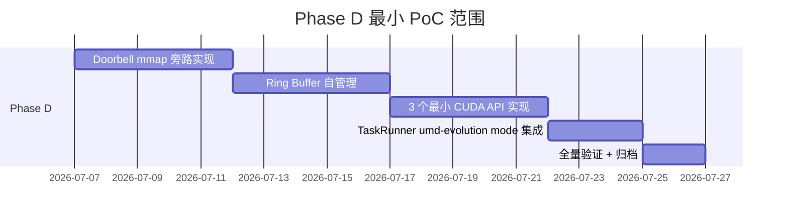

# Design: H-3 Maintenance Transition 执行设计

> **依赖**: proposal ✅
> **状态**: 📋 PROPOSED (2026-06-26)
> **目标**: 详细设计 H-3 系列收官清扫工作流 + 执行顺序 + 后续建议

## Context

### 当前状态

H-3.6/3.7/3.8 的修复层面已完成，但**项目管理层面**有 3 项未清扫的耦合项：

```
Issue 修复层面                                  项目管理层面
─────────────────────────────────────────────  ────────────────────────────────
H-3.6 bf8192f (attached_queues 强校验)         openspec change → PROPOSED (未归档)
H-3.7 392a496 (GpuQueueEmu 抽象层)              openspec change → PROPOSED (未归档)
H-3.8 02ae421 (stream_id u32→u64 ABI 拓宽)       openspec change → PROPOSED (未归档)
                                                cross-repo template → TBD x5
                                                sync-plan.md → v2.1 (无 H-3.6/3.7/3.8)
```

### 问题剖析

1. **PROPOSED ≠ ARCHIVED**: 所有 3 个 openspec changes 仍标注 `status: PROPOSED`，会让后续阅读者以为"仍在进行中"
2. **TBD x5**: `cross-repo-h7-template.md` 历史 PR 范例表有 5 个 TBD（实际 commit hashes 已知但未填入）
3. **sync-plan.md lag**: v2.1 的 H-3 架构描述只到 Phase 2 (5 ioctl wrappers)，H-3.5/3.6/3.7/3.8 全部缺失
4. **无验证信号**: 3 个 issue 修复后从未跑过**全量** build + test（只在各 PR 上独立验证）

## Goals / Non-Goals

**Goals**:
- 归档 3 个 PROPOSED openspec changes → ARCHIVED
- 更新跨仓 template 历史表 TBD → 实际数据
- 更新 sync-plan.md v2.1 → v2.2（新增 H-3.5/3.6/3.7/3.8 段）
- 全量双模式 build + test 验证
- 验证跨仓 4-step 链路完整性

**Non-Goals**:
- 不启动新功能开发
- 不修改生产代码
- 不创建新 ADR/TADR

## Execution Order（推荐执行顺序）

### Phase A: 归档（P0, ~15min）

**顺序**: H-3.6 → H-3.7 → H-3.8

```bash
cd /workspace/project/UsrLinuxEmu
openspec archive 2026-06-26-h3-6-issue-3-coordination -y --skip-specs
git add openspec/changes/archive/ && git rm -r openspec/changes/2026-06-26-h3-6-issue-3-coordination/

openspec archive 2026-06-26-h3-7-issue-2-coordination -y --skip-specs
git add openspec/changes/archive/ && git rm -r openspec/changes/2026-06-26-h3-7-issue-2-coordination/

openspec archive 2026-06-26-h3-8-issue-1-coordination -y --skip-specs
git add openspec/changes/archive/ && git rm -r openspec/changes/2026-06-26-h3-8-issue-1-coordination/

git commit -m "chore(openspec): archive H-3.6/3.7/3.8 coordination changes"
git push origin main
```

> **提醒**: openspec archive 命令会在 archive/ 下重建目录。建议先试 H-3.6 确认效果无误，再批量操作其余 2 个。

### Phase B: TaskRunner 端文档更新（P0, ~1h）

**顺序**: sync-plan.md → cross-repo-template

#### B1. sync-plan.md v2.2

在 `§一、协调工作流` 的架构状态中新增 H-3.5~H-3.8 段：

```markdown
### 2026-06-26: H-3.5~H-3.8 完成 (H-7 deferred 3 issues 全部修复)
- H-3.5 followup: 2 dynamic_cast 删除 + IGpuDriver 31 方法 + MockGpuDriver guards
- H-3.6: Issue #3 attached_queues 强校验 (bf8192f + 09ae1b0)
- H-3.7: Issue #2 GpuQueueEmu 抽象层委托 (392a496)
- H-3.8: Issue #1 stream_id u32→u64 ABI 拓宽 + deprecated alias (02ae421)
- 跨仓同步: 4-step ADR-035 §Rule 5.1 全部完成
- tadr-105 状态: Fully Resolved
```

#### B2. cross-repo-h7-template.md 历史表

| H-# | UsrLinuxEmu PR | TaskRunner bump | TADR 状态 | 归档时间 |
|-----|---------------|----------------|----------|---------|
| H-3.6 | bf8192f + 09ae1b0 | 522e671 | tadr-105 §Issue #3 → Accepted | 2026-06-26 archive |
| H-3.7 | 392a496 | d549208 | tadr-105 §Issue #2 → Accepted | 2026-06-26 archive |
| H-3.8 | 02ae421 | bcd00cf | tadr-105 §Issue #1 → Accepted | 2026-06-26 archive |

### Phase C: 全量 build + test 验证（P1, ~30min）

**执行顺序**: TaskRunner test-fixture → TaskRunner umd-evolution → UsrLinuxEmu

```bash
# === TaskRunner test-fixture ===
cd /workspace/project/UsrLinuxEmu/external/TaskRunner
cmake -B build && cmake --build build -j4 && ctest --test-dir build -V
# 预期: test_cuda_scheduler 8/8 + test_gpu_architecture 11/11 + test_gpu_phase2 12/12

# === TaskRunner umd-evolution ===
cmake -B build -DTASKRUNNER_BUILD_MODE=umd-evolution && cmake --build build -j4 && ctest --test-dir build -V
# 预期: test_umd_skeleton 3/3

# === UsrLinuxEmu ===
cd /workspace/project/UsrLinuxEmu
cmake -B build && cmake --build build -j4 && ctest --test-dir build -V
# 预期: test_gpu_plugin + test_gpu_fence_return + test_queue_puller_integration 全部通过
```

> **关键验证点**: 确认 H-3.8 ABI 拓宽后，test_gpu_phase2 的 12 cases 全部 pass（特别是 queue 创建 + submit 的 4 cases）

### Phase D: UsrLinuxEmu 端同步（P1, ~15min）

- 将 3 个 openspec changes 的 move + commit + push 提交到 UsrLinuxEmu 端
- 更新 `docs/00_adr/adr-034-h7-deferred-registry.md` 补充完成详情段（可选）

### 可选清扫（P2）

| # | 任务 | 工作量 | 建议 |
|---|------|--------|------|
| O1 | tadr-105 终端确认（已更新完毕） | 0 | 已做，跳 |
| O2 | ADR-034 完成详情段补充 | 30min | 建议做（让 ADR 生命周期完整）|
| O3 | docs/README.md 同步状态 | 15min | 可做可不做 |
| O4 | H-3.5~H-3.8 时间线汇总 | 30min | 可选，便于后续追溯 |

## 后续方向建议

### Phase D 启动条件（未来 1-3 月可选）

umd-evolution PoC（Phase D）的建议启动条件：

1. ✅ H-3 系列 3 个 issue 全部修复
2. ⏸️ 维护清扫完成（即本 change 完成）
3. ⏸️ tadr-205 与 UsrLinuxEmu ADR-032~036 交叉引用通过 review
4. ⏸️ 你确认有时间投入 Phase D（预估 2-4 周）

**Phase D 范围建议**（从最小 PoC 开始）:



### PR 2 触发条件（6 月后自动触发）

`stream_id_compat` deprecated alias 清理：
- **触发时间**: 2026-12-26（6 月过渡期结束）
- **触发条件**: `stat stream_id_compat 使用率 == 0%`
- **实施建议**: 2026-11 开始预热通知，2026-12 实际清理

## Risks & Mitigations

| 风险 | 概率 | 影响 | 缓解 |
|------|------|------|------|
| `openspec archive` 命令行为不符预期 | 低 | 低 | 先试 H-3.6 确认效果，再批量操作 |
| 全量 test 因环境问题失败 | 低 | 中 | 检查不通过的原因：是回归还是环境问题 |
| sync-plan.md 版本号冲突 | 低 | 低 | 用 merge conflict 手动解决 |
| 归档后跨仓引用断裂 | 低 | 中 | 检查 archive/ 路径与 change 内路径引用是否一致 |

## Cross-Reference

- **UsrLinuxEmu ADR-035** §Rule 5.1: 4 步归档流程
- **TaskRunner cross-repo-h7-template.md**: 历史 PR 范例表
- **TaskRunner sync-plan.md**: 跨仓同步计划 v2.1 (将被更新为 v2.2)
- **TaskRunner tadr-105**: H-7 deferred registry (fully resolved)
- **openspec/changes/archive/**: 目标目录（已有 20 个 archived changes）

## 执行概要（适合直接跑）

```
Day 1 (~2h):
  Phase A: openspec archive 3 changes       15min
  Phase B: sync-plan.md + template update    1h
  Phase C: 全量 build + test                 30min
  Phase D: UsrLinuxEmu 端提交 + push         15min
  Total: ~2h
```